# KD0001 Coding Box Kit for Arduino

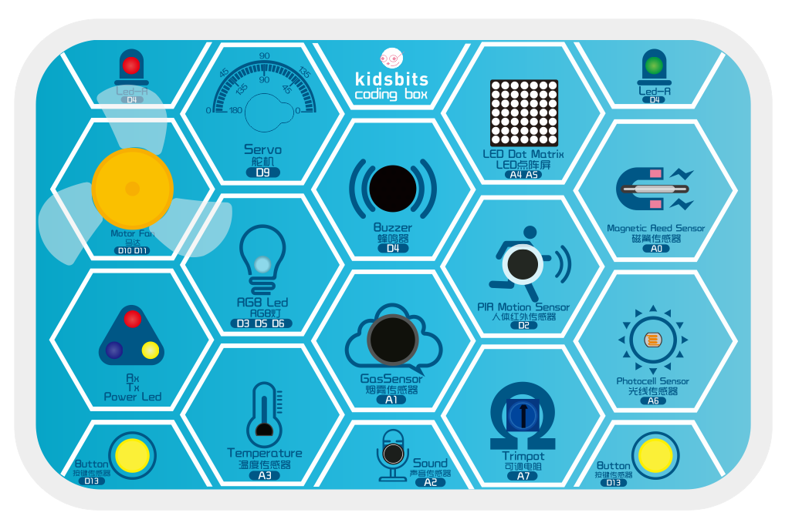

## 1.Introduction

Coding Box is a programming learning toolbox based on Arduino, which is a
programming tool specially designed for children over 6 years old.

Coding Box integrates some of the most basic electronic components and sensors,
such as LED, buttons, motors and light, sound, infrared and temperature sensors,
and etc. Lots of interesting projects can be carried out via Coding Box,
including flashing LEDs, making intrusion alarms, smart fans, and temperature
testers and others.

Coding Box uses Arduino for programming, and is also compatible with MIXLY
blockly graphics programming software, allowing children to learn from the
simplest code and master the system's programming knowledge step by step.

Download the Projects tutorial:

https://kd.kidsbits.cc/KD0001

## 2.Component List

| Name               | Picture                                         | Interface                                    | Summary                                                                                                                                                                                                                                                                                                                                                                                                                                     |
|--------------------|-------------------------------------------------|----------------------------------------------|---------------------------------------------------------------------------------------------------------------------------------------------------------------------------------------------------------------------------------------------------------------------------------------------------------------------------------------------------------------------------------------------------------------------------------------------|
| LED                | 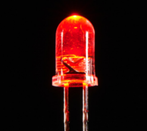 | Connected to digital pin D7 and D8           | LIGHT-EMITTING DIODES (LEDS) have a positive (+) leg and a negative (-) leg, which make electricity flow through in one direction. LEDs can also burn out if too much electricity flows through them, so you should use a resistor to limit the high current when you wire an LED into a circuit. They can be used to make equipment indicator light. Set the signal pin to HIGH, LED on; set to LOW, LED off.                              |
| RGB                | 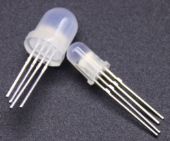 | Connected to PWM digital pins D6, D5 and D3. | RGB LED is actually three small LEDs — a red, green and blue LED— inside a normal LED housing. This RGB LED has all the internal LEDs sharing the same ground wire, so there are four legs in total. It can emit many different colors. Used widely for building lighting and exhibition lighting.                                                                                                                                          |
| LED Dot Matrix     | 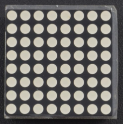 | Connected to Analog pins A4, A5              | LED Dot Matrix: This tiny display has 64 LEDs packed into a 88 dot matrix. It is great for displaying image/text or creating animations, and is highly portable and convenient to use. It is widely used in train stations, advertising screens and bulletin boards.                                                                                                                                                                        |
| Servo motor        | 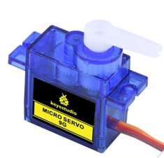 | Connected to PWM digital pin D9              | Servo motor is a position control rotary actuator. Common servos rotate over a range of about 0°to 180°. Servo motor has three wires: one for power, one for grounding and one for signal. When you send the right signal through the signal wire, the servo will move to a specific angle and stay there. It is widely applied to mechanical arm.                                                                                          |
| Buzzer             | 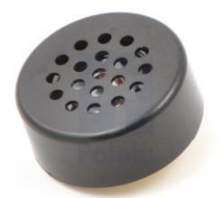 | Connected to Digital pin D4                  | Buzzer is a consumable component that can generate sound of a specified frequency according to the input signal. It is widely used in alarm, electronic toys, automotive electronics, telephones and other electronic products.                                                                                                                                                                                                             |
| Motor fan          | 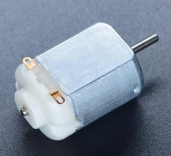 | Connected to PWM digital pin D10, D11        | Motor fan module is a consumable component that is connected with a fan blade and a motor (130 DC motor). It can rotate more than 12,000 times per minute. Widely used in helicopters, windmills, etc.                                                                                                                                                                                                                                      |
| Button             | 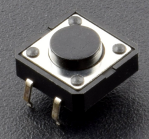 | Connected to digital pin D12, D13            | Button is a component that controls the circuit to turn on and off. When the button is pressed, it sends a high level signal (the Arduino Uno reads 0) to the \*Kidsbits Coding Box (based on Arduino Uno) through the pin D. The switch have a nice, tactile, “clicky” feedback when you press it. We can interact with the device by using buttons, such as the buttons used to create the responder in the course                        |
| Photocell Sensor   | 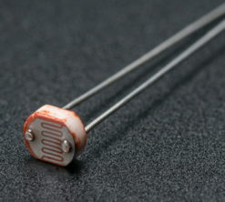 | Connected to Analog pin A6                   | Photocell sensor is a light-sensitive, variable resistor. Photovaristor is an element that changes its resistance as light strength changes. The stronger the ambient light, the smaller the value output from the pin A. Photocell is widely applied to various light control circuit, such as optical switches, and smart home system etc.                                                                                                |
| Potentiometer      | 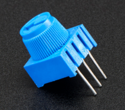 | Connected to analog pin A7                   | Potentiometer (also known as ''trimpot”) is a sensor that controls the output signal of the pin by changing the resistance value. A potentiometer is a 3-pin variable resistor. When powered with 5V, the middle pin outputs a voltage between 0V and 5V, depending on the position of the knob on the potentiometer. It is mainly used to set the threshold value in the circuit, or as a controller to control the Servo motion, etc.     |
| Sound Sensor       | 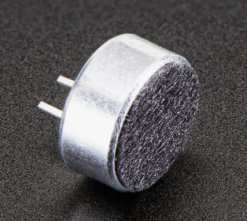 | Connected to analog pin A2                   | Sound Sensor is a device which convert energy from one form to another. A microphone is a transducer which converts sound energy to electrical signals. The microphones are widely used in electronic circuits to detect minor sounds or air vibrations which in turn are converted to electrical signals for further use. The top face is covered with a porous material with the help of glue. It acts as a filter for the dust particles |
| Temperature Sensor | 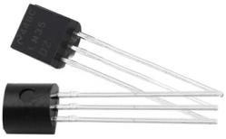 | Connected to Analog pin A3                   | Temperature Sensor is a component that can convert the measured temperature signal into a voltage signal output. It is widely used in digital thermometers, medical/home thermometers, portable non-contact infrared temperature thermometers, etc.                                                                                                                                                                                         |
| Gas Sensor         | 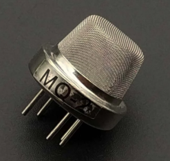 | Connected to analog pin A1                   | Gas Sensor is a component that can detect the concentration of flammable gases and smoke in the environment. It is widely used in household gas leak alarms, industrial combustible gas alarms and portable gas detectors.                                                                                                                                                                                                                  |
| PIR Motion Sensor  | 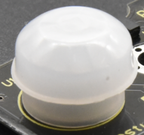 | Connected to digital pin D2.                 | PIR Motion Sensor is a sensor that uses the characteristics of temperature change to detect infrared radiation. When a person enters its sensing range, it outputs a high level. When the person leaves the sensing range, it automatically delays the high level and outputs a low level. Widely used in infrared automatic sensor lights, sensor switches, burglar alarms, infrared greeters, etc                                         |
| Reed switch        | 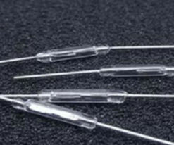 | Connected to analog pin A0.                  | Reed Sensor, also known as reed switch, is an electrical switch operated by an applied magnetic field. Widely used in home appliances, automotive, communications, industrial, medical, security and other fields. An example of a reed switch application is to detect the opening of a door, when used as a proximity switch for a security alarm.                                                                                        |

## 3.Download Software & Install Driver

### 3.1 Windows System

(1) Download the Arduino IDE

When getting this control board, we need to install Arduino IDE

Enter the website
<https://www.arduino.cc/>，clickand

Select the version you want to download, the latest version could be downloaded.

Alternatively, you could select previous release.

In this project, we use 1.8.12 version

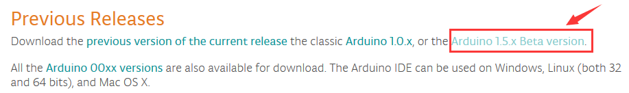

Click to view the below page

Click  to download an installer
of Arduino 1.8.12 version，which needs to be installed manually. When you
tap，a zip file of Arduino 1.8.12
version will be directly downloaded, and you only need to unzip it to finish
installation.

Click icon to download Arduino
IDE.

(2) Download Driver of CH340

[CH340 Chip Driver](https://fs.keyestudio.com/CH340-WIN)

(3) Install the Driver

The driver will be installed after downloading Arduino IDE.

If your system is Windows 10, the computer will automatically install driver.

For other systems, like Windows7, we need to install driver manually.

The USB to serial chip of control board is CH340G. Therefore, we will install
the driver(usb_ch341_3.1.2009.06) for it.

Connect control board to computer with USB cable.

Click Computer----- Properties----- Device Manager, as shown below:

Then right-click on the USB2.0-Serial and select the top menu option (Update
Driver) shown as the figure below.

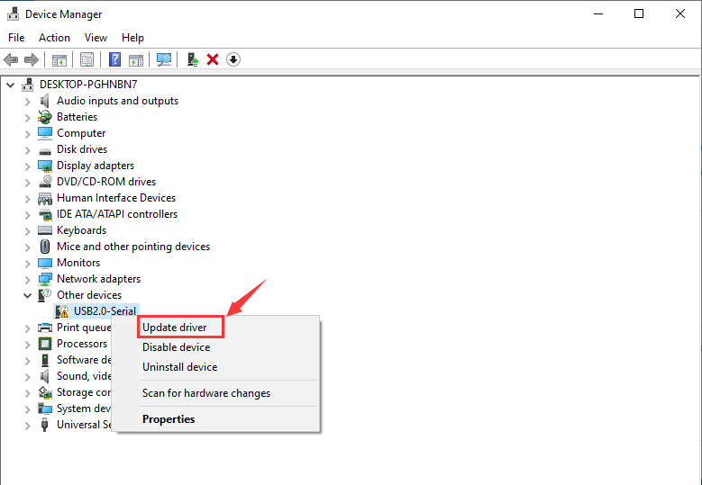

Then it will be prompted to either“Search automatically for driver ” or “Browse
my computer for drivers”. Shown as below. In this page, select “Browse my
computer for drivers”.

After that, select the option to browse and navigate to the “drivers” folder of
usb_ch341_3.1.2009.06 installation.

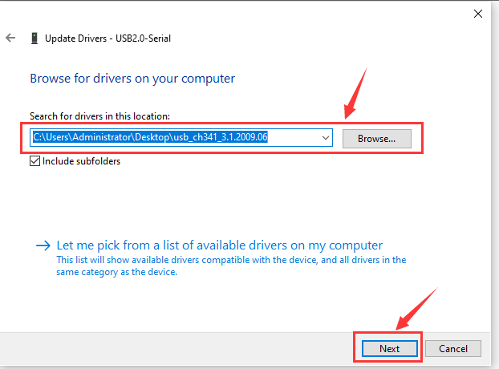

Once the software has been installed, you will get a confirmation message.
Installation completed, click“Close”.
<http://wiki.keyestudio.com/index.php/File:Driver_6.png>

Now, the driver is installed well. Then you can right click

“Computer” —\>“Properties”—\>“Device manager”, you should see

the device as the figure shown below.

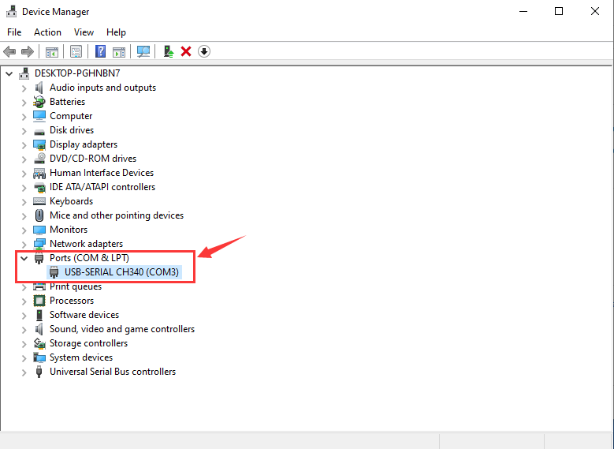

### 3.2 MAC System

(1) Install Arduino IDE on MAC System

The installation instruction is as same as chapter 3.1, as shown below:

(2) Download Driver of CH340

<https://fs.keyestudio.com/CH340-MAC>

(3) How to Install Driver of CH340

Please refer to the following link:

<https://wiki.keyestudio.com/Download_CH340_Driver_on_MAC_System>

There are various versions for Arduino, just download a suitable version for
your system. We will take WINDOWS system as an example to show you how to
download and install.

There are two versions for WINDOWS system, one is installed version, another one
is download version. You just need to download the file to computer directly and
unzip it. These two versions can be used normally. Choose one and download on
your computer.

### 3.3 Arduino IDE Setting

Clickicon，open Arduino IDE.

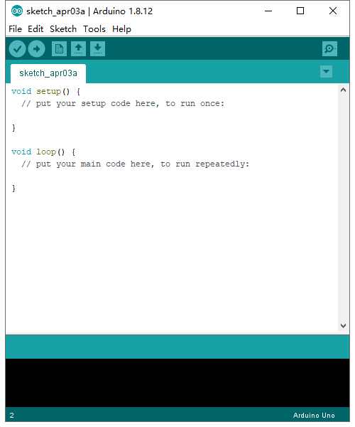

To avoid the errors when uploading the program to the board, you need to select
the correct Arduino board that matches the board connected to your computer.

Then come back to the Arduino software, you should click Tools→Board, select the
board. (as shown below)

Then select the correct COM port (you can see the corresponding COM port after
the driver is successfully installed)

Before uploading the program to the board, let’s demonstrate the function of
each symbol in the Arduino IDE toolbar.

A- Used to verify whether there is any compiling mistakes or not.

B- Used to upload the sketch to your Arduino board.

C- Used to create shortcut window of a new sketch.

D- Used to directly open an example sketch.

E- Used to save the sketch.

F- Used to send the serial data received from board to the serial monitor.

### 3.4 Start your first program

Open the file to select Example, choose BLINK from BASIC, as shown below:

dfInterface D3, D5, D6, D7, D8 in the coding box all can control LEDs. During
the test, it is necessary to change the code in LED_BUILTIN to the corresponding
interface. For example, in the picture below, it is D7.

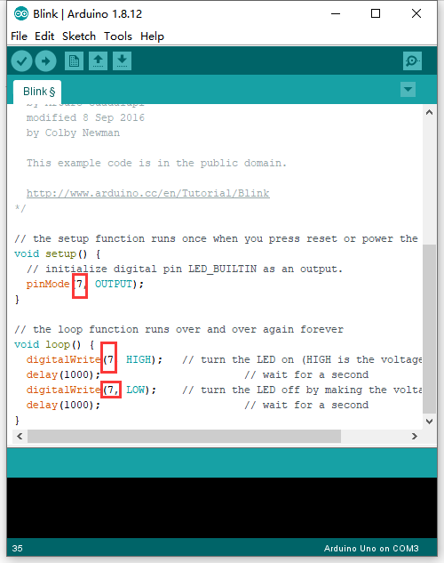

Set board and COM port, the corresponding board and COM port are shown on the
lower right of IDE.

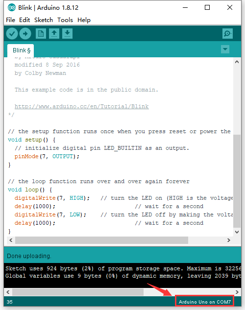

Clickto start compiling the
program, and check errors.

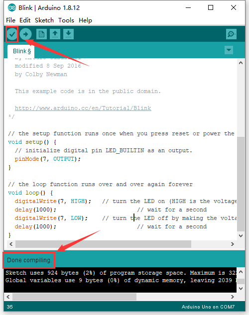

Clickto upload the program,
upload successfully.

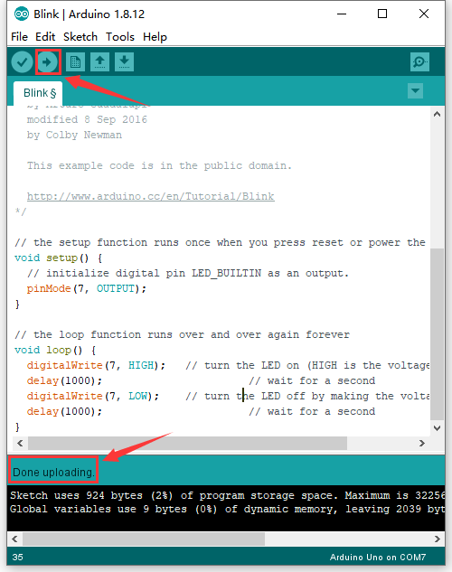

Upload the program successfully, the on-board LED lights on for 1s, lights off
for 1s. Congratulation, you have finished the first program.

### 3.5 Add Libraries to Arduino

What are Libraries ?

[Libraries](https://www.arduino.cc/en/Reference/Libraries) are a collection of
code that makes it easy for you to connect to a sensor, display, module, etc.

For example, the built-in LiquidCrystal library helps LCD displays.

There are hundreds of additional libraries available on the Internet for
download.

Here we will introduce the most simple way for you to add libraries .

Step 1：After downloading well the Arduino IDE, you can right-click the icon of
Arduino IDE.

Find the option "Open file location" shown as below:

Step 2: Enter it to find libraries folder which is the library file of Arduino.

Step 3：Next to find out the“libraries”of coding box kit(seen in the link:

You just need to replicate and paste its libraries into the libraries of Arduino
IDE.

The library of this kit is successfully installed, as shown below:

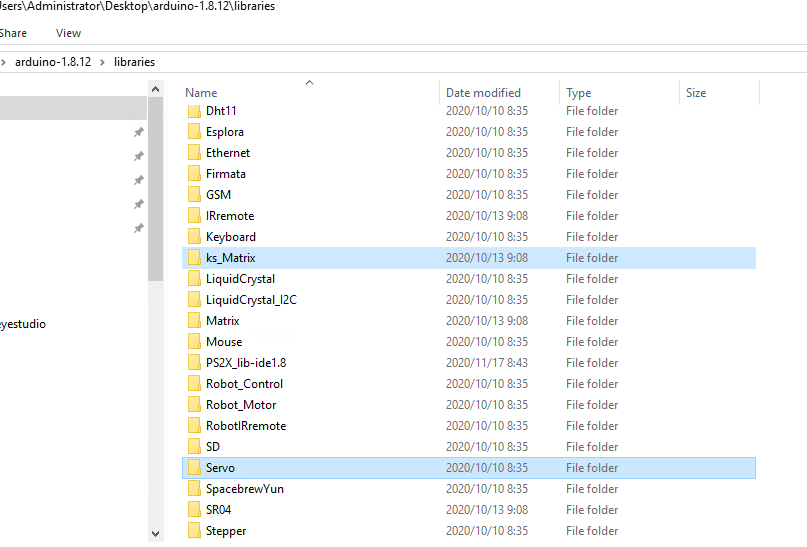

## 4.Project Details

### Project 1: Hello World

**Project Introduction**

As for starters, we will begin with something simple. In this project, you only
need a PLUS board and a USB cable to start the "Hello World!" project. It is not
only a communication test of your Arduino and PC, but also an enlightening
project for you to have your first try in the Arduino world!

**Project Code**

After installing driver for Arduino, let's open Arduino software and compile
code that enables Arduino to print "Hello World!" .

~~~~~~~~~~~~~~~~~~~~~~~~~~~~~~~~~~~~~~~~~~~~~~~~~~~~~~~~~~~~~~~~~~~~~~~~~~~~~~~~
  \*Kidsbits Coding Box

  Project 1

  Hello World

  http//www.kidsbits.cc

  */

  int val;//define variable val

  void setup()

  {

  Serial.begin(9600);// set the baud rate at 9600 .

  }

  void loop()

  {

  val=Serial.read();// read the Introduction or character from PC to Arduino, and
  assign them to Val.

  if(val=='R')// determine if the Introduction or character received is “R”.

  { // if it’s “R”,

  Serial.println("Hello World!");// display“Hello World！”string.

  }}

  /////////////////////////////////////////////////////////////////
~~~~~~~~~~~~~~~~~~~~~~~~~~~~~~~~~~~~~~~~~~~~~~~~~~~~~~~~~~~~~~~~~~~~~~~~~~~~~~~~

**Project Result**

Click to open the serial monitor, input an“R”, PC will receive the information
from Arduino Hello World!

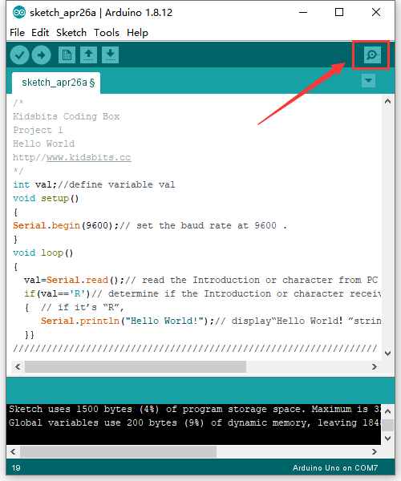

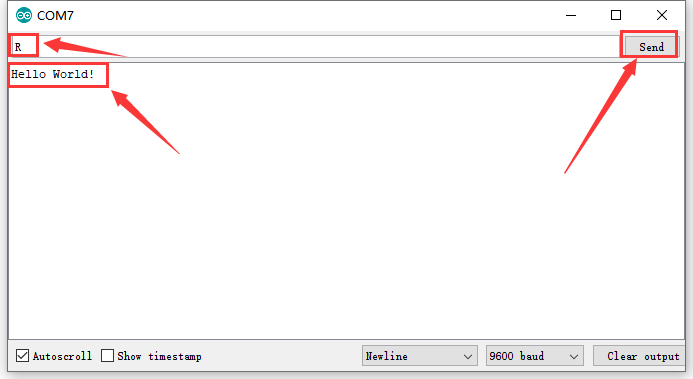

After choosing the proper port, the project is easy for you!

**next project**\*\*\*

### Project 2: Blink

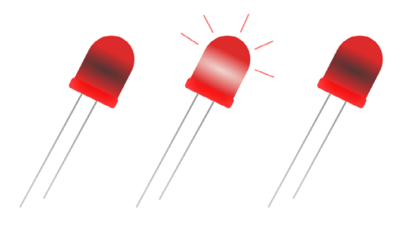

**Project Introduction**

In this project, we start to learn the digital output of Arduino. We used the
digital pin of Arduino to turn on an LED and let it blink.

**Working Principle**

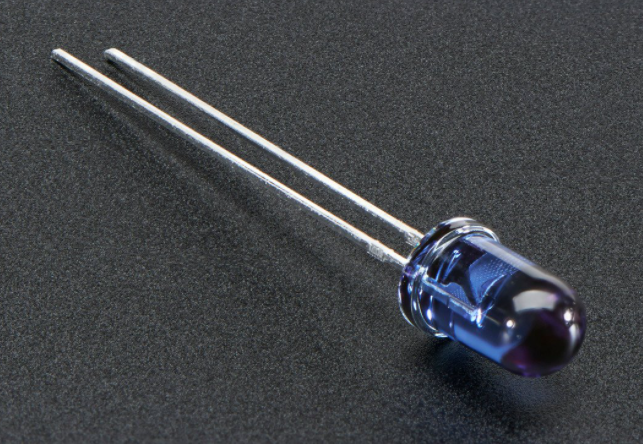

LED is a type of semiconductor called "Light Emitting Diode "which is an
electronic device made of semiconductor materials (silicon, selenium, germanium,
etc.). It is dubbed indicator, digital and word display in circuit and device.
It has positive and negative poles. The short leg is the negative pole, and the
long one is the positive pole.

**Circuit Connection**

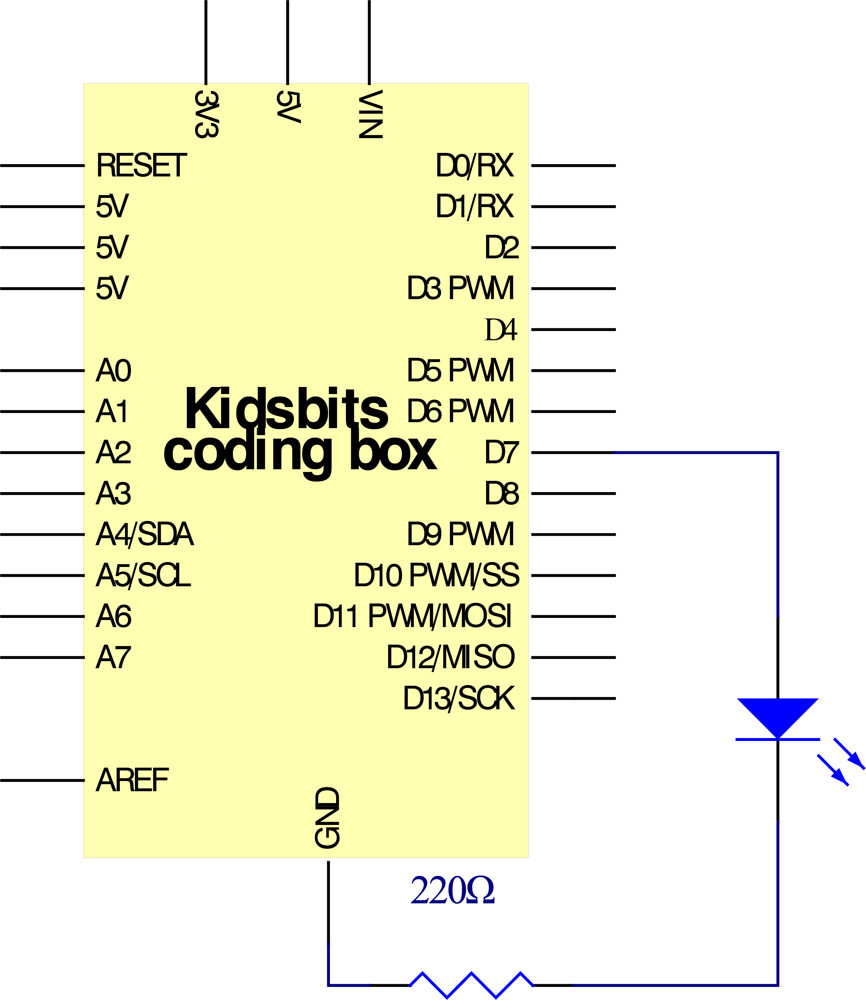

**Project Code**

~~~~~~~~~~~~~~~~~~~~~~~~~~~~~~~~~~~~~~~~~~~~~~~~~~~~~~~~~~~~~~~~~~~~~~~~~~~~~~~~
  \*Kidsbits Coding Box

  Project 2

  Blink

  http//www.kidsbits.cc

  */

  int ledPin = 7; // define digital pin 7.

  void setup()

  {

  pinMode(ledPin, OUTPUT);// define led pin as output.

  }

  void loop()

  {

  digitalWrite(ledPin, HIGH); // set the LED on.

  delay(1000); // wait for a second.

  digitalWrite(ledPin, LOW); // set the LED off.

  delay(1000); // wait for a second

  }

  //////////////////////////////////////////////////////////////////
~~~~~~~~~~~~~~~~~~~~~~~~~~~~~~~~~~~~~~~~~~~~~~~~~~~~~~~~~~~~~~~~~~~~~~~~~~~~~~~~

**Project Result**

Upload the code to the coding box successfully, you can see that the red LED of
D7 starts blinking, which is on for 1 second and off for 1 second.

**next project**\*\*\*

### Project 3: SOS

**Project Introduction**

The SOS distress signal is an international Morse code distress signal asking
for help. Morse code is a character encoding. Each letter of English is composed
of different combinations of bars and dots. The advantage of this is that using
the simple two symbols all letters and numbers can be transmitted, which is very
simple!

**Working Principle**

The letters can be spelled out through the two states of the LED switch, using
long flashing and short flashing to indicate dots and bars. Just spell the three
letters S.O.S.

By consulting the Morse code table, we can know that the letter "S" is
represented by three dots, and we use short blinking instead, and the letter "O"
is represented by three horizontal bars, which is replaced by long blinking
here.

**Circuit Connection**

**Project Code**

~~~~~~~~~~~~~~~~~~~~~~~~~~~~~~~~~~~~~~~~~~~~~~~~~~~~~~~~~~~~~~~~~~~~~~~~~~~~~~~~
  \*Kidsbits Coding Box

  Project 3

  s o s

  http//www.kidsbits.cc

  */

  int ledPin = 7;

  void setup()

  {

  pinMode(ledPin, OUTPUT);

  }

  void loop() {

  // Three fast flashes to indicate the letter "S"

  for(int x=0;x\<3;x++){

  digitalWrite(ledPin,HIGH); //Set the LED to on

  delay(150); //Delay 150 milliseconds

  digitalWrite(ledPin,LOW); //Set the LED to off

  delay(100); //Delay 100 milliseconds

  }

  delay(100);

  //Three short flashes to indicate the letter "O"

  for(int x=0;x\<3;x++)

  {

  digitalWrite(ledPin,HIGH); //Set the LED to on

  delay(400); //delay 400 milliseconds

  digitalWrite(ledPin,LOW); //Set the LED to off

  delay(100); //delay 100 milliseconds

  }

  delay(100);

  // three quick flashes to represent the letter "S"

  for(int x=0;x\<3;x++)

  {

  digitalWrite(ledPin,HIGH); //Set the LED to on

  delay(150); //Delay 150 milliseconds

  digitalWrite(ledPin,LOW); //Set the LED to off

  delay(100); //delay 100 milliseconds

  }

  // Wait 5 seconds before repeating the S.0.S signal

  delay(5000);

  }

  \\\\\\\\\\\\\\\\\\\\\\\\\\\\\\\\\\\\\\\\\\\\\\\\\\\\\\\\\\\\\\\\\\\\\\\\\\\\\\\\\\\\\\\\\\\\\\\\\\\\\\\\\\\\\\\\\\\\\\\\\\\\
~~~~~~~~~~~~~~~~~~~~~~~~~~~~~~~~~~~~~~~~~~~~~~~~~~~~~~~~~~~~~~~~~~~~~~~~~~~~~~~~

**Project Result**

After uploading the code to the coding box, you can see that the red LED at D7
fast flash 3 times and then slowly flash 3 times alternatively, which can
stimulate SOS alarm in Morse code.

**next project**\*\*\*

### Project 4: PWM

**Project Introduction**

In this project, we will learn the PWM control of ARDUINO. PWM is the
abbreviation of Pulse Width Modulation, which is a technology that encodes
analog signal level into digital signal level. We use PWM to control an LED
gradually from bright to dark.

**Working Principle**

The PWM signal is also digitalized because in any given moment, fully on DC
power supply is either 5V (ON), or 0V (OFF). The voltage or current is fed to
the analog load (the device that uses the power) by repeated pulse sequence
being ON or OFF. Being on, the current is fed to the load; being off, it's not.
With adequate bandwidth, any analog value can be encoded using PWM. The output
voltage value is calculated via the on and off time.

Output voltage = (turn on time/pulse time) maximum voltage value

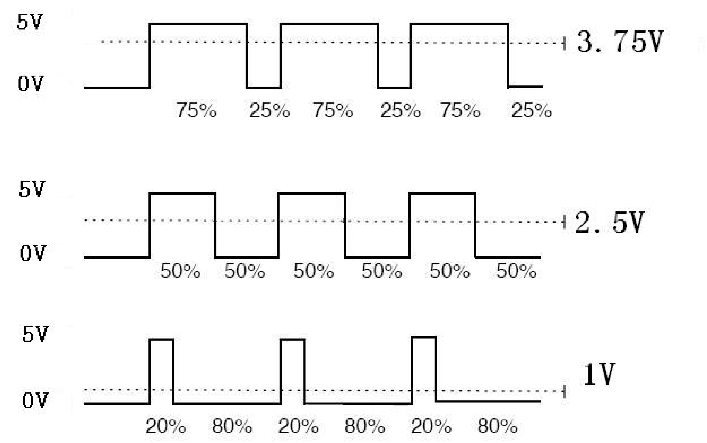

PWM has many applications like lamp brightness regulating, motor speed
regulating, sound making, etc.

The following are the three basic parameters of PMW.

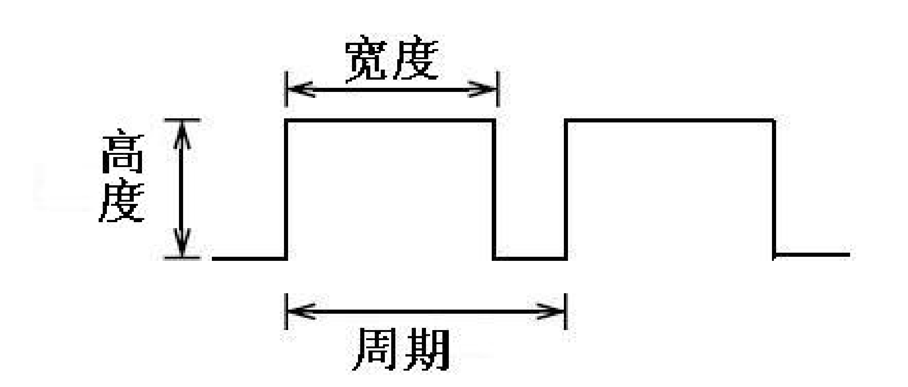

1.  The amplitude of pulse width (minimum / maximum)

2\. The pulse period (The reciprocal of pulse frequency in one second)

3\. The voltage level（such as 0V-5V）

There are 6 PMW interfaces on Arduino, namely digital pin 3, 5, 6, 9, 10, and
11.

In previous experiments, we have done "button-controlled LED", using digital
signal to control digital pin, also one about potentiometer.

This time, we will use a potentiometer to control the brightness of the LED.

**Circuit Connection**

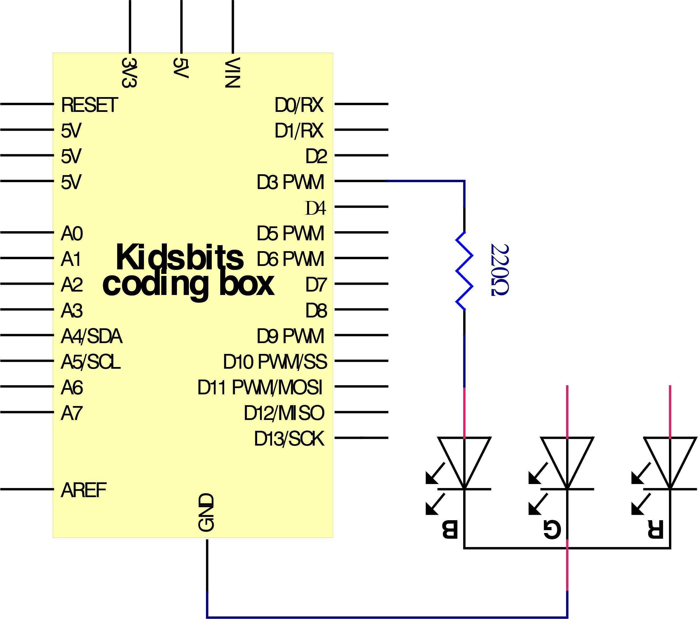

**Project Code**

~~~~~~~~~~~~~~~~~~~~~~~~~~~~~~~~~~~~~~~~~~~~~~~~~~~~~~~~~~~~~~~~~~~~~~~~~~~~~~~~
  \*Kidsbits Coding Box

  Project 4

  PWM

  http//www.kidsbits.cc

  */

  int ledPin = 3;

  void setup()

  {

  pinMode(ledPin,OUTPUT);

  }

  void loop(){

  for (int value = 0 ; value \< 255; value=value+1){

  analogWrite(ledPin, value);

  delay(5);

  }

  for (int value = 255; value \>0; value=value-1){

  analogWrite(ledPin, value);

  delay(5);

  } }

  /////////////////////////////////////////////////////////////////
~~~~~~~~~~~~~~~~~~~~~~~~~~~~~~~~~~~~~~~~~~~~~~~~~~~~~~~~~~~~~~~~~~~~~~~~~~~~~~~~

**Project Result**

After uploading the code to the coding box, you can see the blue light in the
RGB on the coding box constantly brightening and dimming, just like a breathing
light.

**next project**\*\*\*

### Project 5: RGB Color

**Project Introduction**

The RGB color mode is a color standard in the industry. It obtains various
colors by changing the three color channels of red (R), green (G), and blue (B)
and integrating them. RGB denotes the three colors of red, green and blue.

**Working Principle**

The monitors mostly adopt the RGB color standard, and all the colors on the
computer screen are composed of the three colors of red, green and blue mixed in
different proportions.

And we could adjust the LED brightness by PWM.

**Circuit Connection**

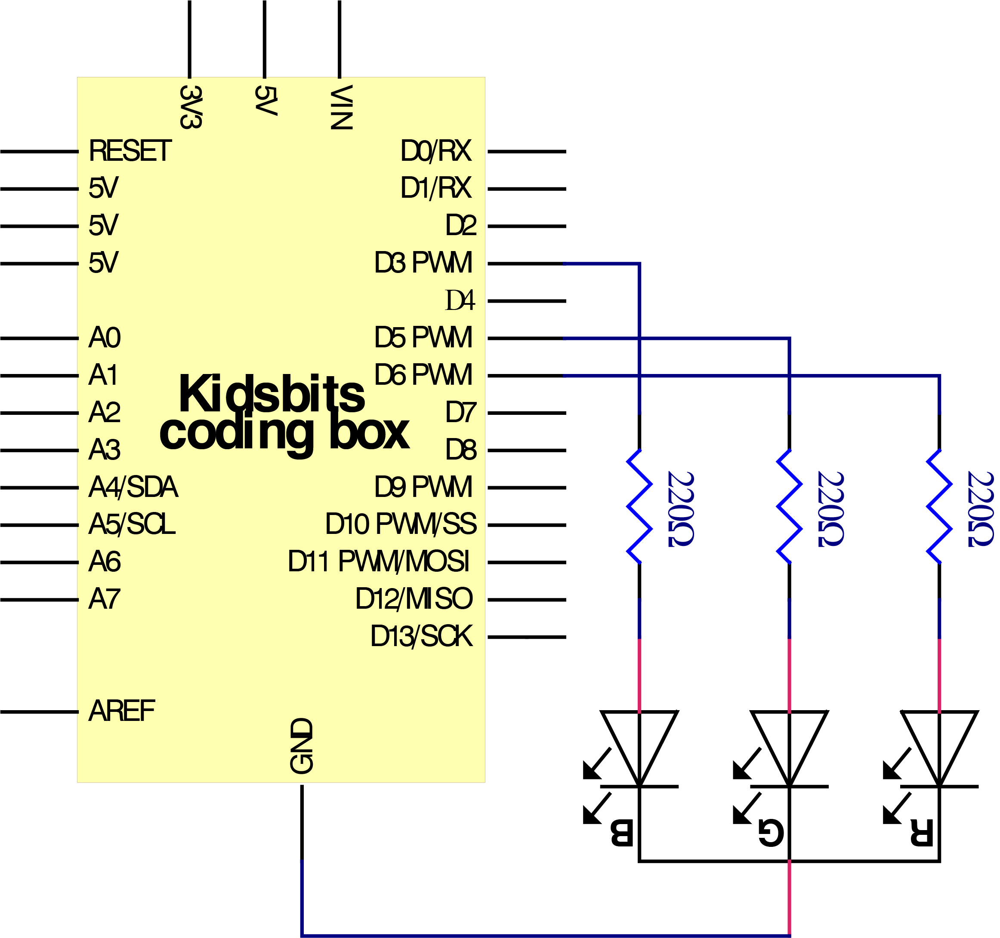

**Project Result**

After uploading the code to the coding box, you can see the light of the RGB
light on the coding box, and the color keeps changing.

**next project**\*\*\*

### Project 6: Play Music

**Project Introduction**

In the previous project, we studied the active buzzer, which can only emit one
sound, which feels rather monotonous.

This project will learn another buzzer, passive buzzer. The characteristic of
the passive buzzer is that it can emit sounds of different frequencies. This
characteristic allows the buzzer to play music melody.

We used the shape of a bird that really likes to sing to complete this project.
We can code some different songs, which is very interesting.

**Working Principle**

Passive buzzer is an integrated electronic buzzer without vibration source
inside. It must be driven by 2K-5K square wave instead of direct current
signals. There is little difference between the two kinds of buzzers, but when
the pins of the two buzzers are placed up, the passive buzzer comes with green
circuit board, and the one sealed with vinyl is an active buzzer.

**Circuit Connection**

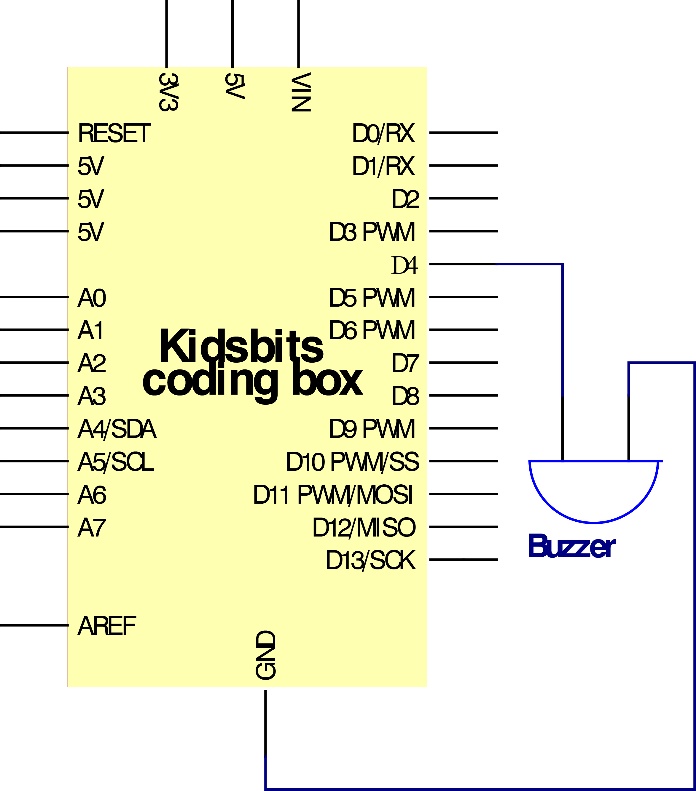

**Project Code**

~~~~~~~~~~~~~~~~~~~~~~~~~~~~~~~~~~~~~~~~~~~~~~~~~~~~~~~~~~~~~~~~~~~~~~~~~~~~~~~~
  \*Kidsbits Coding Box

  Project 6

  Play Music

  http//www.kidsbits.cc

  */

  \#define NOTE_B0 31

  \#define NOTE_C1 33

  \#define NOTE_CS1 35

  \#define NOTE_D1 37

  \#define NOTE_DS1 39

  \#define NOTE_E1 41

  \#define NOTE_F1 44

  \#define NOTE_FS1 46

  \#define NOTE_G1 49

  \#define NOTE_GS1 52

  \#define NOTE_A1 55

  \#define NOTE_AS1 58

  \#define NOTE_B1 62

  \#define NOTE_C2 65

  \#define NOTE_CS2 69

  \#define NOTE_D2 73

  \#define NOTE_DS2 78

  \#define NOTE_E2 82

  \#define NOTE_F2 87

  \#define NOTE_FS2 93

  \#define NOTE_G2 98

  \#define NOTE_GS2 104

  \#define NOTE_A2 110

  \#define NOTE_AS2 117

  \#define NOTE_B2 123

  \#define NOTE_C3 131

  \#define NOTE_CS3 139

  \#define NOTE_D3 147

  \#define NOTE_DS3 156

  \#define NOTE_E3 165

  \#define NOTE_F3 175

  \#define NOTE_FS3 185

  \#define NOTE_G3 196

  \#define NOTE_GS3 208

  \#define NOTE_A3 220

  \#define NOTE_AS3 233

  \#define NOTE_B3 247

  \#define NOTE_C4 262

  \#define NOTE_CS4 277

  \#define NOTE_D4 294

  \#define NOTE_DS4 311

  \#define NOTE_E4 330

  \#define NOTE_F4 349

  \#define NOTE_FS4 370

  \#define NOTE_G4 392

  \#define NOTE_GS4 415

  \#define NOTE_A4 440

  \#define NOTE_AS4 466

  \#define NOTE_B4 494

  \#define NOTE_C5 523

  \#define NOTE_CS5 554

  \#define NOTE_D5 587

  \#define NOTE_DS5 622

  \#define NOTE_E5 659

  \#define NOTE_F5 698

  \#define NOTE_FS5 740

  \#define NOTE_G5 784

  \#define NOTE_GS5 831

  \#define NOTE_A5 880

  \#define NOTE_AS5 932

  \#define NOTE_B5 988

  \#define NOTE_C6 1047

  \#define NOTE_CS6 1109

  \#define NOTE_D6 1175

  \#define NOTE_DS6 1245

  \#define NOTE_E6 1319

  \#define NOTE_F6 1397

  \#define NOTE_FS6 1480

  \#define NOTE_G6 1568

  \#define NOTE_GS6 1661

  \#define NOTE_A6 1760

  \#define NOTE_AS6 1865

  \#define NOTE_B6 1976

  \#define NOTE_C7 2093

  \#define NOTE_CS7 2217

  \#define NOTE_D7 2349

  \#define NOTE_DS7 2489

  \#define NOTE_E7 2637

  \#define NOTE_F7 2794

  \#define NOTE_FS7 2960

  \#define NOTE_G7 3136

  \#define NOTE_GS7 3322

  \#define NOTE_A7 3520

  \#define NOTE_AS7 3729

  \#define NOTE_B7 3951

  \#define NOTE_C8 4186

  \#define NOTE_CS8 4435

  \#define NOTE_D8 4699

  \#define NOTE_DS8 4978

  \#define REST 0

  // change this to make the song slower or faster

  int tempo=114;

  // change this to whichever pin you want to use

  int buzzer = 4;

  // notes of the moledy followed by the duration.

  // a 4 means a quarter note, 8 an eighteenth , 16 sixteenth, so on

  // !!negative numbers are used to represent dotted notes,

  // so -4 means a dotted quarter note, that is, a quarter plus an eighteenth!!

  int melody[] = {

  NOTE_E4,4, NOTE_E4,4, NOTE_F4,4, NOTE_G4,4,//1

  NOTE_G4,4, NOTE_F4,4, NOTE_E4,4, NOTE_D4,4,

  NOTE_C4,4, NOTE_C4,4, NOTE_D4,4, NOTE_E4,4,

  NOTE_E4,-4, NOTE_D4,8, NOTE_D4,2,

  NOTE_E4,4, NOTE_E4,4, NOTE_F4,4, NOTE_G4,4,//4

  NOTE_G4,4, NOTE_F4,4, NOTE_E4,4, NOTE_D4,4,

  NOTE_C4,4, NOTE_C4,4, NOTE_D4,4, NOTE_E4,4,

  NOTE_D4,-4, NOTE_C4,8, NOTE_C4,2,

  NOTE_D4,4, NOTE_D4,4, NOTE_E4,4, NOTE_C4,4,//8

  NOTE_D4,4, NOTE_E4,8, NOTE_F4,8, NOTE_E4,4, NOTE_C4,4,

  NOTE_D4,4, NOTE_E4,8, NOTE_F4,8, NOTE_E4,4, NOTE_D4,4,

  NOTE_C4,4, NOTE_D4,4, NOTE_G3,2,

  NOTE_E4,4, NOTE_E4,4, NOTE_F4,4, NOTE_G4,4,//12

  NOTE_G4,4, NOTE_F4,4, NOTE_E4,4, NOTE_D4,4,

  NOTE_C4,4, NOTE_C4,4, NOTE_D4,4, NOTE_E4,4,

  NOTE_D4,-4, NOTE_C4,8, NOTE_C4,2

  };

  // sizeof gives the number of bytes, each int value is composed of two bytes (16
  bits)

  // there are two values per note (pitch and duration), so for each note there
  are four bytes

  int notes=sizeof(melody)/sizeof(melody[0])/2;

  // this calculates the duration of a whole note in ms (60s/tempo)4 beats

  int wholenote = (60000 4) / tempo;

  int divider = 0, noteDuration = 0;

  void setup() {

  // iterate over the notes of the melody.

  // Remember, the array is twice the number of notes (notes + durations)

  for (int thisNote = 0; thisNote \< notes 2; thisNote = thisNote + 2) {

  // calculates the duration of each note

  divider = melody[thisNote + 1];

  if (divider \> 0) {

  // regular note, just proceed

  noteDuration = (wholenote) / divider;

  } else if (divider \< 0) {

  // dotted notes are represented with negative durations!!

  noteDuration = (wholenote) / abs(divider);

  noteDuration = 1.5; // increases the duration in half for dotted notes

  }

  // we only play the note for 90% of the duration, leaving 10% as a pause

  tone(buzzer, melody[thisNote], noteDuration0.9);

  // Wait for the specief duration before playing the next note.

  delay(noteDuration);

  // stop the waveform generation before the next note.

  noTone(buzzer);

  }

  }

  void loop() {

  // if you want to repeat the song forever,

  // just paste the setup code here instead.

  }

  /////////////////////////////////////////////////////////////////
~~~~~~~~~~~~~~~~~~~~~~~~~~~~~~~~~~~~~~~~~~~~~~~~~~~~~~~~~~~~~~~~~~~~~~~~~~~~~~~~

**Project Result**

After uploading the code to the coding box, you can hear the buzzer playing the
song "Ode to Joy" on the coding box.

**next project**\*\*\*

### Project 7: Small Desktop Lamp

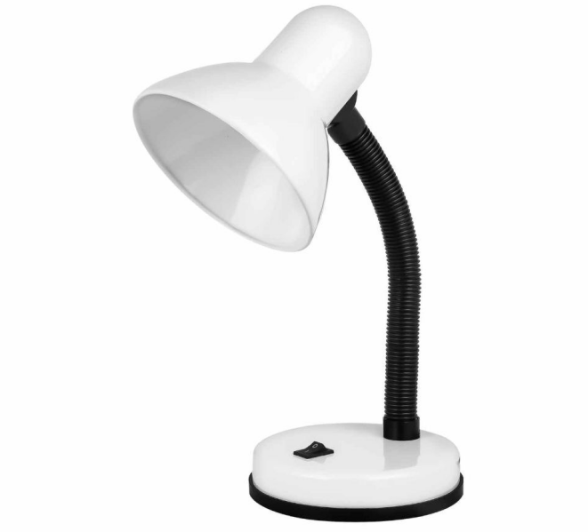

**Project Introduction**

The button switch is an electronic switch. When we press the button, the switch
function is turned on. When the pressure is removed, the switch is turned off.
Its internal structure is realized by changing the force of the metal shrapnel.

In this project, we use a button switch and an LED to make a small desk lamp
project. Press the button to turn on the LED, and press button to turn off the
LED.

**Working Principle**

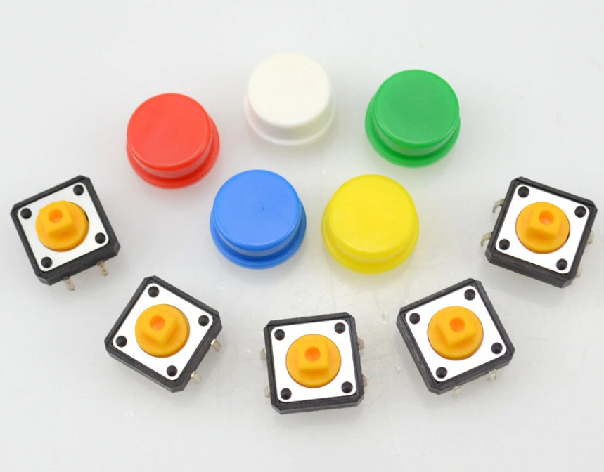

I believe that button switch is common and popular for people. It belongs to
switch quantity( digital quantity)component. Composed of normally open contact
and normally closed contact,its working principle is similar with ordinary
switch.

When the normally open contact bears pressure, the circuit is on state ;
however, when this pressure disappears, the normally open contact goes back to
initial state, that is, off state. The pressure is the act we switch the button.

**Schematic Diagrams:**

**Circuit Connection**

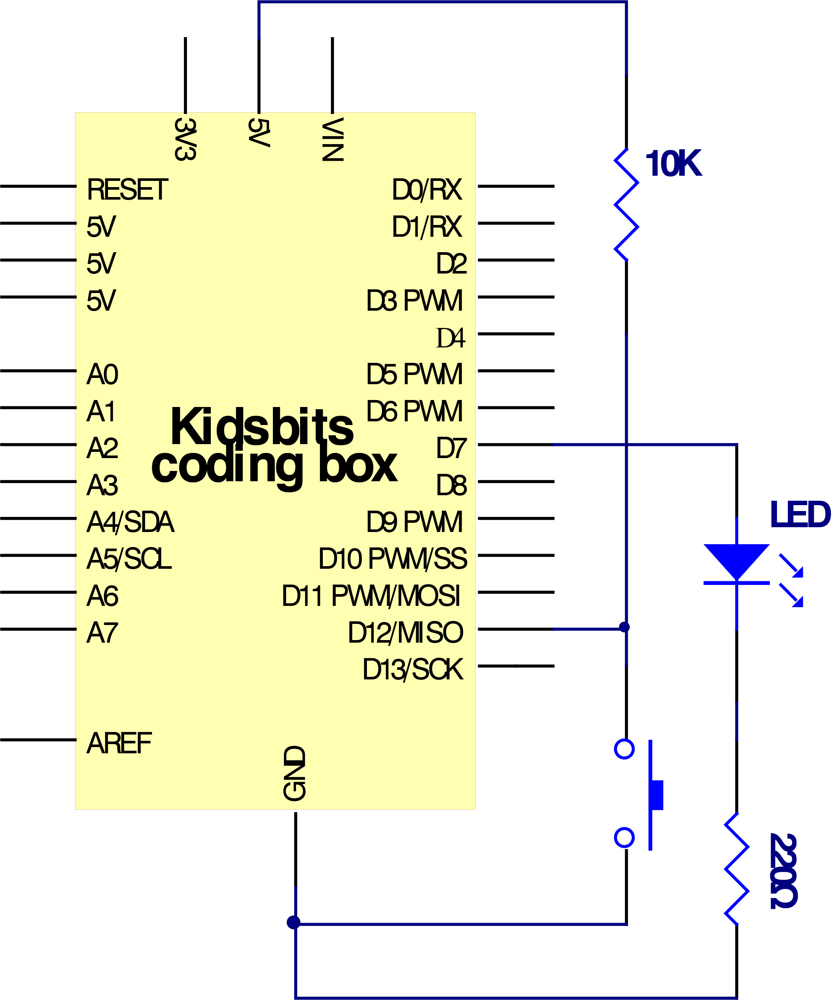

**Project Code**

~~~~~~~~~~~~~~~~~~~~~~~~~~~~~~~~~~~~~~~~~~~~~~~~~~~~~~~~~~~~~~~~~~~~~~~~~~~~~~~~
  \*Kidsbits Coding Box

  Project 7

  Small desktop lamp

  http//www.kidsbits.cc

  */

  volatile int PushCounter;

  volatile int State;

  volatile int lastState;

  int ledpin=7;// initialize pin 7

  int inpin=12;// initialize pin 12

  void setup()

  {

  PushCounter = 0;

  State = 0;

  lastState = 0;

  pinMode(ledpin,OUTPUT);// set LED pin as “output”

  pinMode(inpin,INPUT);// set button pin as “input”

  }

  void loop()

  {

  State = digitalRead(inpin);

  if (State != lastState) {

  if (State == 1) {

  PushCounter = PushCounter + 1;

  }

  }

  delay(100);

  lastState = State;

  if(PushCounter%2==0)

  { digitalWrite(ledpin,HIGH);}

  else

  { digitalWrite(ledpin,LOW);}

  }

  //////////////////////////////////////////////////////////////////
~~~~~~~~~~~~~~~~~~~~~~~~~~~~~~~~~~~~~~~~~~~~~~~~~~~~~~~~~~~~~~~~~~~~~~~~~~~~~~~~

**Project Result**

After uploading the code to the coding box, when the button at D12 is pressed
once, the light at D7 is on;when the button is pressed again, the light at D7
goes out; the same working situation as the desk lamp.

**next project**\*\*\*

### Project 8: PIR Motion Alarm

****

**Project Introduction**

PIR motion sensor can detect infrared signals from a moving person or moving
animal, and output switching signals. It can be applied to a variety of
occasions to detect the movement of human body.

For example, in the corridor at night, the PIR motion sensor senses someone
going upstairs, and the light turns on automatically, which is not only
practical but also environmentally friendly.

**PIR Motion Sensor Specification**

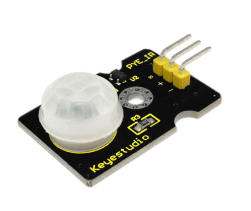

-   Input Voltage 3.3 \~ 5V (6V Maximum)

-   Working Current 15uA

-   Working Temperature -20 \~ 85 ℃

-   Output Voltage High 3V, Low 0V

-   Output Delay Time (High Level) About 2.3 to 3 Seconds

-   Detection Angle 100 °

-   Detection Distance 7 meters

-   Output Indicator LED (When output HIGH, it will be ON)

-   Pin limit Current 100mA

**Circuit Connection**

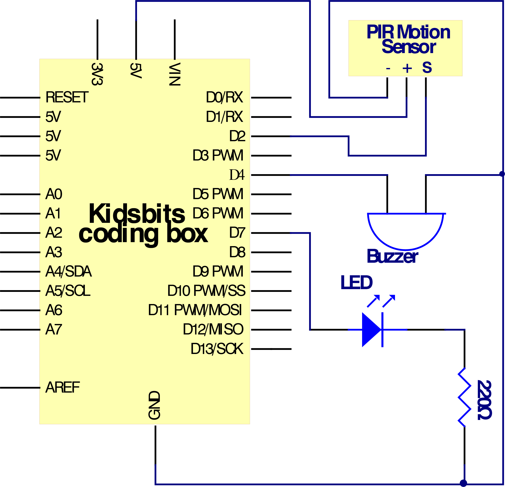

**Project Code**

~~~~~~~~~~~~~~~~~~~~~~~~~~~~~~~~~~~~~~~~~~~~~~~~~~~~~~~~~~~~~~~~~~~~~~~~~~~~~~~~
  \*Kidsbits Coding Box

  Project 8

  PIR Motion Alarm

  http//www.kidsbits.cc

  */

  int Sensor_pin = 2; //define pin D2 of PIR sensor

  int Buzzerpin = 4; //Define the pin D4 of the buzzer

  int ledpin =7; //Define the pin D7 of the LED light

  void Alarm() //The buzzer sounds an alarm

  {

  for(int i=0;i\<100;i++)

  {

  digitalWrite(Buzzerpin,HIGH); //make a sound

  delay(2);

  digitalWrite(Buzzerpin,LOW); //No sound

  delay(2); //Modify the delay time, change the sound frequency

  }

  }

  void setup()

  {

  pinMode(Sensor_pin,INPUT); //Define PIR sensor interface as input

  pinMode(Buzzerpin,OUTPUT); //Define the buzzer interface as output

  pinMode(ledpin,OUTPUT); //Define the LED interface as output

  }

  void loop()

  {

  int val=digitalRead(Sensor_pin); //Define the parameter to store the state read
  by the PIR sensor

  if(val == 1) //If someone is detected (within the detection range)

  {

  Alarm();//The buzzer sounds an alarm

  digitalWrite(ledpin, HIGH); // LED flashes

  delay(10);

  digitalWrite(ledpin, LOW);

  delay(10);

  }

  else//If no person is detected

  {

  return;

  }

  delay(100); //delay 100 milliseconds

  }
//////////////////////////////////////////////////////////////////
~~~~~~~~~~~~~~~~~~~~~~~~~~~~~~~~~~~~~~~~~~~~~~~~~~~~~~~~~~~~~~~~~~~~~~~~~~~~~~~~

**Project Result**

Uploading the code to the coding box, when the human infrared sensor detects
people moving nearby,the LED starts flashing, the buzzer sounds. If no one is
detected nearby, the LED is off and the buzzer does not sound.

**next project**\*\*\*

### Project 9: Reed switch

**Project Introduction**

Reed switch is basically an electrical switch which is operated when a magnetic
field is brought near to it. It is made up of two small metal pieces kept inside
a glass tube under vacuum. In a typical reed switch, two metal pieces will be
made of a ferromagnetic material and covered with rhodium or ruthenium to give
them long life. The switch will be activated when there is a presence of
magnetic field around the switch.

Reed switch is used in many of the real-life applications such as magnetic door
switch, laptops, smart phones etc.

**Sensor Specification**

There are two types of reed switch.

Normally open reed switch

Normally closed reed switch

In normally open reed switch, switch is open in the absence of magnetic field
and it is closed in the presence of magnetic field. Under the presence of
magnetic field, two metal contacts inside the glass tube attract each other to
make contact.

In normally closed reed switch, switch is closed in the absence of magnetic
field and it is open in the presence of magnetic field.

The glass enclosure of the two metal pieces protect them from dirt, dust and
other particles. Reed switch can be operated in any environment such as
environment where flammable gas is present or environment where corrosion would
affect open switch contacts.

**Circuit Connection**

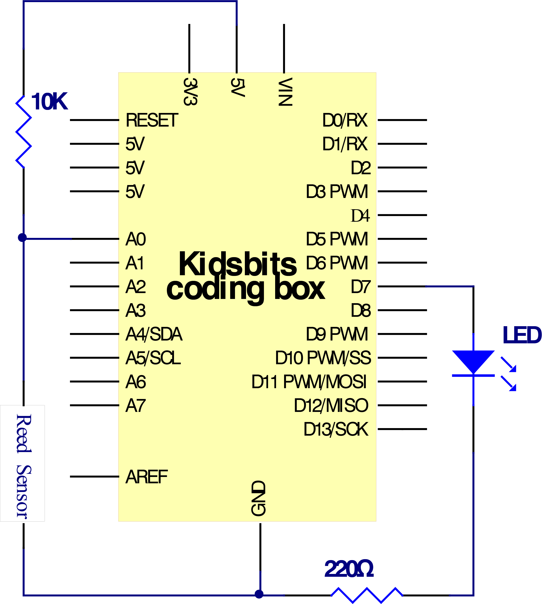

**Project Code**

~~~~~~~~~~~~~~~~~~~~~~~~~~~~~~~~~~~~~~~~~~~~~~~~~~~~~~~~~~~~~~~~~~~~~~~~~~~~~~~~
  \*Kidsbits Coding Box

  Project 9

  Reed switch

  http//www.kidsbits.cc

  */

  int LED = 7;

  int reed_switch = A0;

  int reed_status;

  void setup()

  {

  pinMode(LED, OUTPUT);

  pinMode(reed_switch, INPUT);

  }

  void loop()

  {

  reed_status = digitalRead(reed_switch);

  if (reed_status == 1)

  digitalWrite(LED, LOW);

  else

  digitalWrite(LED, HIGH);

  }

  //////////////////////////////////////////////////////////
~~~~~~~~~~~~~~~~~~~~~~~~~~~~~~~~~~~~~~~~~~~~~~~~~~~~~~~~~~~~~~~~~~~~~~~~~~~~~~~~

**Project Result**

After uploading the code to the coding box, when the magnetic reed detects
nearby magnetic force, the LED lights up. If no magnetic force is detected, the
LED is off.

**next project**\*\*\*

### Project 10: DC motor

**Project Introduction**

With this coding box, we can make our own adjustable fan.Usually a simple
electric fan is made up of blade, motor and switch. You can see a motor fan
module on the \*Kidsbits Coding Box. The motor is actually the electric motor.
If there is electricity, the fan blade will rotate. The motor with the fan blade
is also called a fan module. Inputting HIGH or LOW level to two pins of fan
module, we can make fan rotate.

**Connection Diagram**

So set to D10, LOW; D11 to HIGH. Upload the code and motor fan will turn
clockwise.

If we set the D10 to HIGH, D11 to LOW, the fan will turn anticlockwise.

If we set to D10 and D11 to LOW, the fan won’t turn.

Now, we’ve known how to control fan. But how about making fan rotate slowly?
Here we can use PWM pins.

PWM pins can steadily output the HIGH and LOW level, and can continuously change
HIGH or LOW in a regular time period. The D10 and 11 of motor fan are PWM pins.
We can adjust the motor’s speed via PWM pins.

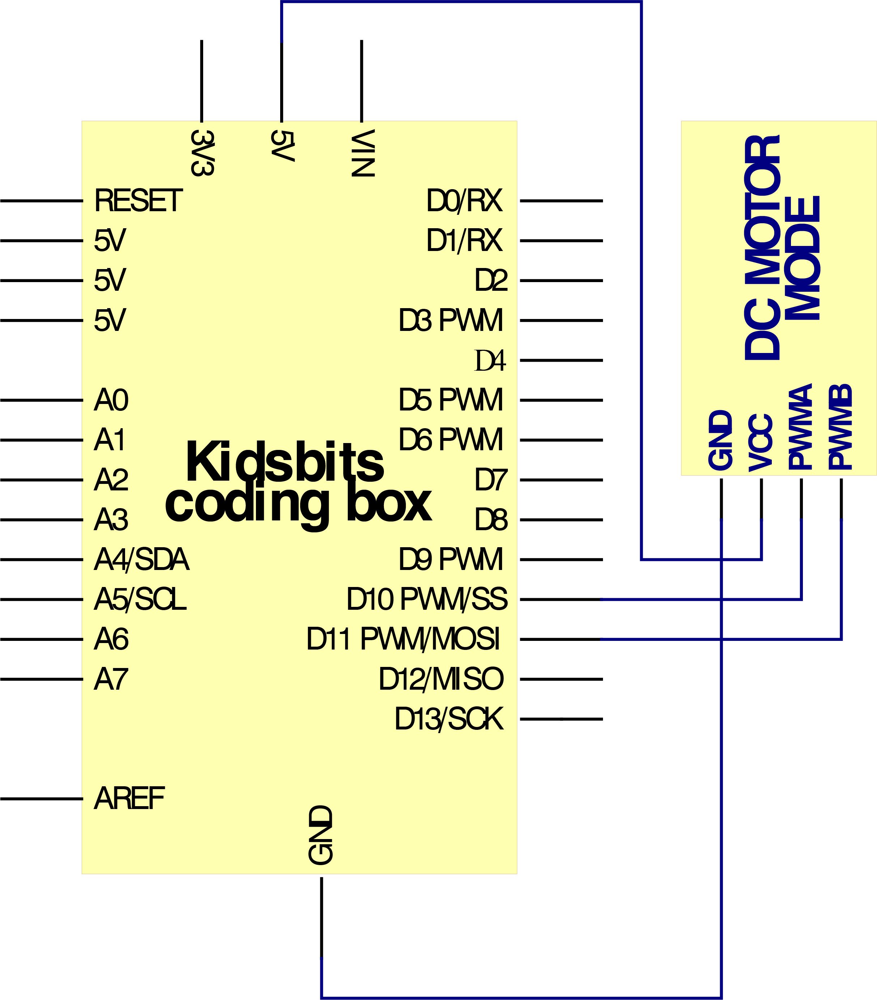

**Project Code**

~~~~~~~~~~~~~~~~~~~~~~~~~~~~~~~~~~~~~~~~~~~~~~~~~~~~~~~~~~~~~~~~~~~~~~~~~~~~~~~~
  \*Kidsbits Coding Box

  Project 10

  small fan

  http//www.kidsbits.cc

  */

  // the setup function runs once when you press reset or power the board

  void setup() {

  // initialize digital pin 10 11 as output.

  pinMode(10, OUTPUT);

  pinMode(11, OUTPUT);

  digitalWrite(10, LOW);

  digitalWrite(11, LOW);

  }

  // the loop function runs over and over again forever

  void loop() {

  analogWrite(10, 150);

  digitalWrite(11, LOW);

  delay(1000);

  digitalWrite(10, LOW);

  digitalWrite(11, LOW);

  delay(3000);

  digitalWrite(10, LOW);

  analogWrite(11, 150);

  delay(1000);

  digitalWrite(10, LOW);

  digitalWrite(11, LOW);

  delay(3000);

  }

  //////////////////////////////////////////////////////////
~~~~~~~~~~~~~~~~~~~~~~~~~~~~~~~~~~~~~~~~~~~~~~~~~~~~~~~~~~~~~~~~~~~~~~~~~~~~~~~~

**Project Result**

After uploading the code to the coding box, the motor on the coding box rotates
clockwise for 1 second, with a delay of 3 seconds.Then turn counterclockwise for
1 second, delay 3 seconds, and loop.

**next project**\*\*\*

### Project 11: Servo

**Project Introduction**

Servo is a position (angle) servo drive, which is suitable for those control
systems that require constant angle changes and can be maintained. It has been
widely used in remote control toys, airplane models, submarine models, and
remote control robots.

In this project, we use the servo rotation angle change to DIY a car speed dial.
You can intuitively understand the servo's movement trajectory.

**Working Principle**

Servo is composed of rudder disc, position feedback potentiometer, reduction
gear set, DC motor and control circuit. The reduction gear set is driven by a DC
motor, and its output shaft drives a position feedback potentiometer with linear
proportional characteristics as position detection. According to the feedback
voltage of the potentiometer, the control circuit compares with the external
input control pulse, generates a correction pulse, controls and drives the DC
motor to rotate forward or reverse, so that the output position of the reduction
gear is combined with the desired value. So as to achieve the purpose of
accurately controlling the steering angle.

Servo's control pulse cycle is 20ms, and the pulse width ranges from 0.5ms to
2.5ms, corresponding to positions from -90 degrees to +90 degrees, taking a 180
degree angle servo as an example

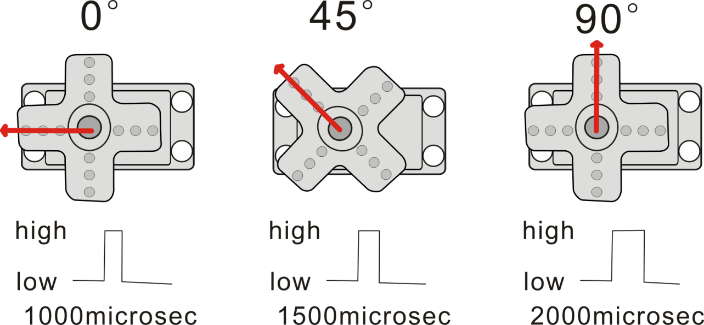

Servo motor comes with many specifications. But all of them have three
connection wires, distinguished by brown, red, orange (different brand may have
different color).

Brown one is for GND, red one for power positive, orange one for signal line.

**Connection Diagram**

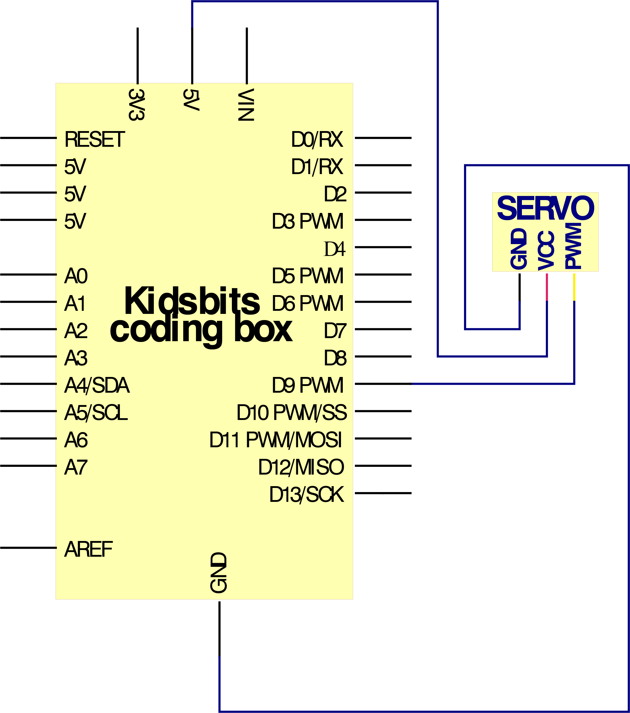

**Project Code**

~~~~~~~~~~~~~~~~~~~~~~~~~~~~~~~~~~~~~~~~~~~~~~~~~~~~~~~~~~~~~~~~~~~~~~~~~~~~~~~~
  \*Kidsbits Coding Box

  Project 11

  Servo

  http//www.kidsbits.cc

  */

  \#include \<Servo.h\>

  Servo myservo;// define servo variable name

  void setup()

  {

  myservo.attach(9);// select servo pin(9 or 10)

  }

  void loop()

  {

  myservo.write(0);// set rotate angle of the motor

  delay(500);

  myservo.write(45);// set rotate angle of the motor

  delay(500);

  myservo.write(90);// set rotate angle of the motor

  delay(500);

  myservo.write(135);// set rotate angle of the motor

  delay(500);

  myservo.write(180);// set rotate angle of the motor

  delay(500);

  }//////////////////////////////////////////////////////////
~~~~~~~~~~~~~~~~~~~~~~~~~~~~~~~~~~~~~~~~~~~~~~~~~~~~~~~~~~~~~~~~~~~~~~~~~~~~~~~~

Above are the two methods to control the servo. You can choose either one
according to your liking or actual need.

**Project Result**

After uploading the code to the coding box, the servo rotates, the angle starts
from 0°, increases by 45° every 0.5 seconds, and when it reaches 180°, it turns
to the 0° position.

**next project**\*\*\*

### Project 12: Potentiometer

**Project Introduction**

The potentiometer is an electronic component that we are very familiar with. It
is an analog component. The switch for adjusting the volume on the electrical
appliance and the button for adjusting the wind on the fan are all applications
of the potentiometer.

In this project, we are going to learn how to use Arduino to read the value of
the potentiometer, and then cooperate with the LED light to make a Dimming table
lamp.

**Features**

Adjustable potentiometer is just a kind of resistor. The resistance is changed
by rotating the potentiometer, so is the voltage, speed, brightness and
temperature. It is an analog electronic component, which has two states of 0 and
1(high level and low level). The analog quantity is different. Its data state
presents a linear state such as 1 to 1000.

**Read Values**

We connect the adjustable potentiometer to the analog pin of Arduino to read its
value. Please refer to the following wiring diagram for wiring.

~~~~~~~~~~~~~~~~~~~~~~~~~~~~~~~~~~~~~~~~~~~~~~~~~~~~~~~~~~~~~~~~~~~~~~~~~~~~~~~~
  \*Kidsbits Coding Box

  Project 12.1

  Read Potentiometer value

  http//www.kidsbits.cc

  */

  int potpin=A7;// initialize analog pin A7

  int val=0;// define val, assign initial value 0

  void setup()

  {

  Serial.begin(9600);// set baud rate at 9600

  }

  void loop()

  {

  val=analogRead(potpin);// read the analog value of analog pin 0, and assign it
  to val

  Serial.println(val);// display val’s value

  }

  //////////////////////////////////////////////////////////////////
~~~~~~~~~~~~~~~~~~~~~~~~~~~~~~~~~~~~~~~~~~~~~~~~~~~~~~~~~~~~~~~~~~~~~~~~~~~~~~~~

When you rotate the potentiometer knob, you can see the displayed value change.
The reading of analog value is a very common function since most sensors output
analog value. After calculation, you can get the corresponding value you need.

Below figure shows the analog value it reads.

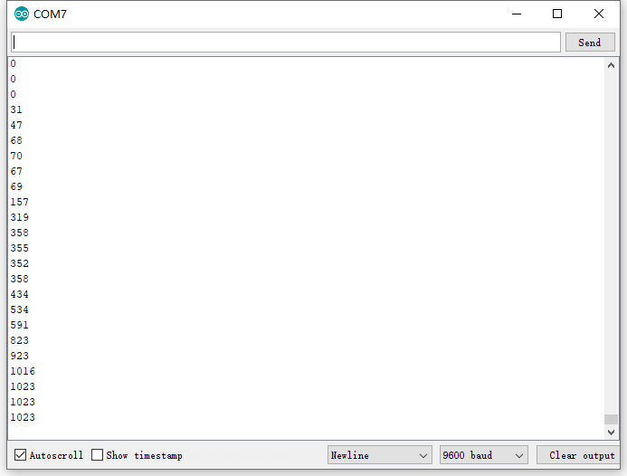

**Circuit Connection**

In the last step, we read the value of the potentiometer, and now we need to
convert the value of the potentiometer into the brightness of the LED to make a
small desk lamp with adjustable brightness. See the wiring diagram.

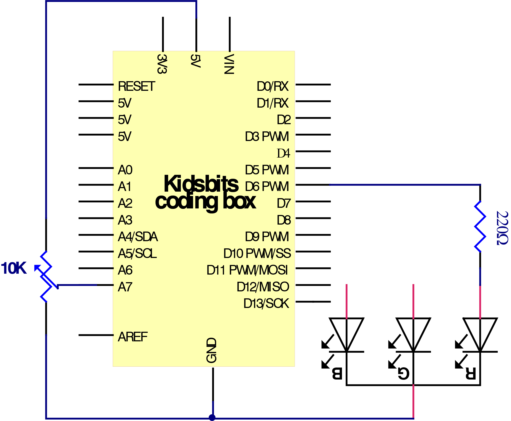

**Project Code**

~~~~~~~~~~~~~~~~~~~~~~~~~~~~~~~~~~~~~~~~~~~~~~~~~~~~~~~~~~~~~~~~~~~~~~~~~~~~~~~~
  \*Kidsbits Coding Box

  Project 12.2

  Dimming table lamp

  http//www.kidsbits.cc

  */

  int potpin=A7;// initialize analog pin 7

  int ledpin=6;//initialize digital pin 6（PWM output）

  int val=0;// Temporarily store variables' value from the sensor

  void setup()

  {

  pinMode(ledpin,OUTPUT);// define digital pin 6 as “output”

  Serial.begin(9600);// set baud rate at 9600

  // attention: for analog ports, they are automatically set up as “input”

  }

  void loop()

  {

  val=analogRead(potpin);// read the analog value from the sensor and assign it to
  val

  Serial.println(val);// display value of val

  analogWrite(ledpin,val/4);// turn on LED and set up brightness（maximum output
  of PWM is 255）

  delay(10);// wait for 0.01 second

  }

  //////////////////////////////////////////////////////////
~~~~~~~~~~~~~~~~~~~~~~~~~~~~~~~~~~~~~~~~~~~~~~~~~~~~~~~~~~~~~~~~~~~~~~~~~~~~~~~~

**Project Result**

After uploading the code to the coding box, you can control the brightness of
the red LED in the RGB through the potentiometer.

**next project**\*\*\*

### Project 13: Light

**Project Introduction**

Photocell is a resistor whose resistance varies from different incident light
strength. It's based on the photoelectric effect of semiconductor. If the
incident light is intense, its resistance reduces; if the incident light is
weak, the resistance increases.

We use the characteristics of Photocell to make a light-controlled table lamp.
When the light is dimmed, the light turns on.

**Photocell Little Knowledge**

Photocell is commonly applied in the measurement of light, light control and
photovoltaic conversion (convert the change of light into the change of
electricity).

Photocell is also being widely applied to various light control circuits, such
as light control and adjustment, optical switches, etc.

We will start with a relatively simple experiment regarding to photovaristor
application.

Photocell is an element that can change its resistance as light strength
changes. So need to read the analog value. You can refer to the PWM experiment,
replacing the potentiometer with photocell\`. When there is change in light
strength, it will make corresponding change on the LED.

**Read Photocell value**

We first use a simple code to read the value of the photocell, print it in the
serial monitor, and wire it as shown below.

~~~~~~~~~~~~~~~~~~~~~~~~~~~~~~~~~~~~~~~~~~~~~~~~~~~~~~~~~~~~~~~~~~~~~~~~~~~~~~~~
  \*Kidsbits Coding Box

  Project 13.1

  Read Photocell value

  http//www.kidsbits.cc

  */

  int photocellpin=A6;// initialize analog pin 6, connected with photocell

  int val=0;// initialize variable va

  void setup()

  {

  Serial.begin(9600);// set baud rate at “9600”

  }

  void loop()

  {

  val=analogRead(photocellpin);// read the value of the sensor and assign it to
  val

  Serial.println(val);// display the value of val

  delay(1000);// wait for 1 s

  }

  //////////////////////////////////////////////////////////////////
~~~~~~~~~~~~~~~~~~~~~~~~~~~~~~~~~~~~~~~~~~~~~~~~~~~~~~~~~~~~~~~~~~~~~~~~~~~~~~~~

Upload the code to the PLUS development board, open the serial monitor, and then
you can read the current photocell value.We put our hands on the photocell, and
the value became larger.

**Circuit Connection**

We made a small dimming table lamp before, and now we want to make a
light-controlled small table lamp. The basic principles of the two are the same.
Both are obtained by obtaining the analog value of the sensor and then adjusting
the brightness of the LED.

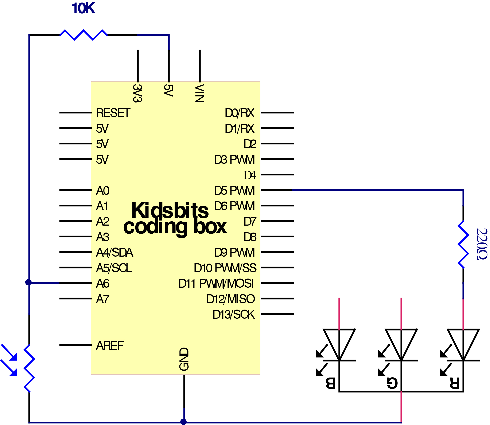

**Project Code**

~~~~~~~~~~~~~~~~~~~~~~~~~~~~~~~~~~~~~~~~~~~~~~~~~~~~~~~~~~~~~~~~~~~~~~~~~~~~~~~~
  \*Kidsbits Coding Box

  Project 13.2

  Light control LED

  http//www.kidsbits.cc

  */

  int potpin=6;// initialize analog pin 6, connected with photocell

  int ledpin=5;// initialize digital pin 5,

  int val=0;// initialize variable va

  void setup()

  {

  pinMode(ledpin,OUTPUT);// set digital pin 11 as “output”

  Serial.begin(9600);// set baud rate at “9600”

  }

  void loop()

  {

  val=analogRead(potpin);// read the value of the sensor and assign it to val

  Serial.println(val);// display the value of val

  analogWrite(ledpin,val/4);// set up brightness（maximum value 255）

  delay(10);// wait for 0.01s

  }

  //////////////////////////////////////////////////////////////////
~~~~~~~~~~~~~~~~~~~~~~~~~~~~~~~~~~~~~~~~~~~~~~~~~~~~~~~~~~~~~~~~~~~~~~~~~~~~~~~~

**Project Result**

After uploading the code to the coding box, the photoresistor can detect the
intensity of the light. The brighter the light, the brighter the red LED in RGB.

**next project**\*\*\*

### Project 14: Sound

**Project Introduction**

The sound sensor is a common sensor. It has a built-in capacitive electret
microphone and power amplifier. It can be used to detect the sound intensity of
the environment.

In this project, we use a sound sensor and a DC motor to make a voice-activated
smart fan. When we make a sound, the fan starts.

**Sound Sensor**

Sound sensor is typically used in detecting the loudness in ambient environment.
The Arduino can collect its output signal by analog input interface.

The S pin is analog output, that is voltage signal real-time output of
microphone. The sensor comes with a potentiometer, so that you can turn it to
adjust the signal gain.

It also has a fixed hole so that you can mount the sensor on any other devices.
You can use it to make some interactive work, such as a voice operated switch.

**Read Sound Sensor Value**

We first use a simple code to read the value of the sound sensor, print it in
the serial monitor, and wire it as shown below.

~~~~~~~~~~~~~~~~~~~~~~~~~~~~~~~~~~~~~~~~~~~~~~~~~~~~~~~~~~~~~~~~~~~~~~~~~~~~~~~~
  \*Kidsbits Coding Box

  Project 14.1

  Read Sound Sensor value

  http//www.kidsbits.cc

  */

  int soundpin=A2;// initialize analog pin 2, connected with sound sensor

  int val=0;// initialize variable va

  void setup()

  {

  Serial.begin(9600);// set baud rate at “9600”

  }

  void loop()

  {

  val=analogRead(soundpin);// read the value of the sensor and assign it to val

  Serial.println(val);// display the value of val

  delay(1000);// wait for 1 s

  }

  //////////////////////////////////////////////////////////////////
~~~~~~~~~~~~~~~~~~~~~~~~~~~~~~~~~~~~~~~~~~~~~~~~~~~~~~~~~~~~~~~~~~~~~~~~~~~~~~~~

Upload the code to the PLUS development board, open the serial monitor, blow or
clap your hands at the sensor, you can see the sensor's value changes
significantly.

**Connection Diagram**

Next, we formally enter this project. We use a sound sensor and a small motor to
make a sound-activated fan. Connect to the circuit diagram below.

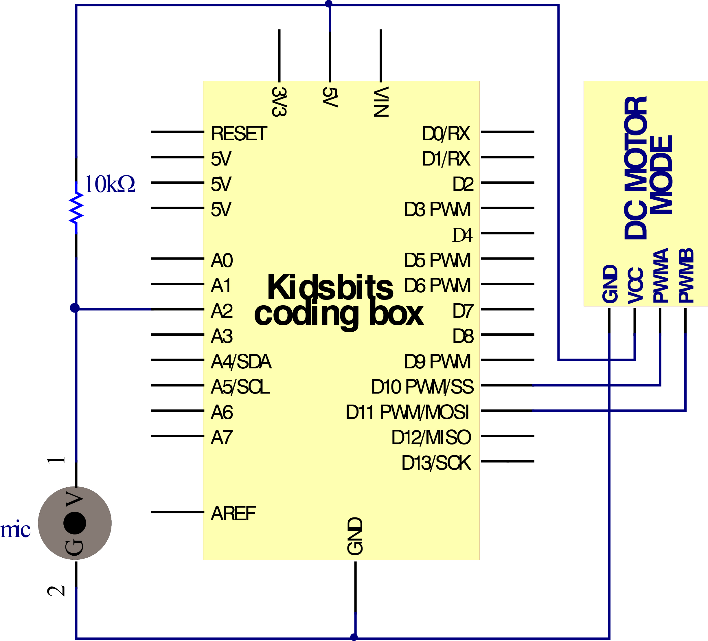

**Project Code**

~~~~~~~~~~~~~~~~~~~~~~~~~~~~~~~~~~~~~~~~~~~~~~~~~~~~~~~~~~~~~~~~~~~~~~~~~~~~~~~~
  \*Kidsbits Coding Box

  Project 14.2

  Voice-activated smart fan

  http//www.kidsbits.cc

  */

  void setup() {

  Serial.begin(9600);

  // initialize digital pin 10 11 as output.

  pinMode(10, OUTPUT);

  pinMode(11, OUTPUT);

  digitalWrite(10, LOW);

  digitalWrite(11, LOW);

  }

  void loop() {

  int Soundvalue = analogRead(A2); // read the input analog value

  Serial.println(Soundvalue);

  if(Soundvalue\>650)

  {

  analogWrite(10, 150);

  digitalWrite(11, LOW);

  delay(1000);

  }

  else{

  digitalWrite(10, LOW);

  digitalWrite(11, LOW);

  }

  }

  //////////////////////////////////////////////////////////
~~~~~~~~~~~~~~~~~~~~~~~~~~~~~~~~~~~~~~~~~~~~~~~~~~~~~~~~~~~~~~~~~~~~~~~~~~~~~~~~

**Project Result**

After uploading the code to the coding box. success, the microphone sensor can
detect the sound. When the value of the sound is greater than 650, the motor fan
starts to rotate. If it does not reach 650, the motor fan does not rotate.

**next project**\*\*\*

### Project 15: Gas Sensor

**Project Introduction**

MQ-2 Gas Sensor module is useful for gas leakage detecting in homes and
industries. It can detect LPG, i-butane, propane, methane, alcohol, hydrogen and
smoke.

**Sensor Specification**

Whenever the concentration of gas increases the resistance will decrease (but
the current flow will get increased). It leads to change in voltage and it is
read at Analog out pin which tells how much gas is concentrated in normal Air.
This varied analog voltage is used to calculate the PPM of Gas.

Similarly, the Module has a Digital output (connected with an Op-Amp) along with
a Potentiometer. The Threshold/Sensitivity can be adjusted using the
Potentiometer. Because to calibrate the sensor to an Idle condition. Once it
reaches the threshold, it will produce the output signal at D0 Pin.

Note: All MQ Sensor takes some time to work properly because of the Heater needs
to be heated for a while.

**Circuit Connection**

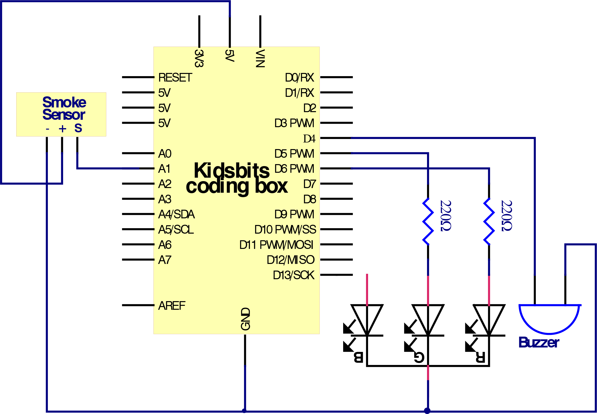

**Project Code**

~~~~~~~~~~~~~~~~~~~~~~~~~~~~~~~~~~~~~~~~~~~~~~~~~~~~~~~~~~~~~~~~~~~~~~~~~~~~~~~~
  \*Kidsbits Coding Box

  Project 15

  Gas Sensor

  http//www.kidsbits.cc

  */

  int redLed = 6;

  int greenLed = 5;

  int buzzer = 4;

  int smokeA0 = A1;

  // Enter Your threshold value

  int sensorThres = 400;

  void setup() {

  pinMode(redLed, OUTPUT);

  pinMode(greenLed, OUTPUT);

  pinMode(buzzer, OUTPUT);

  pinMode(smokeA0, INPUT);

  Serial.begin(9600);

  }

  void loop() {

  int analogSensor = analogRead(smokeA0);

  Serial.print("Sensor Value from A0: ");

  Serial.println(analogSensor);

  // Checks if it has reached the threshold value

  if (analogSensor \> sensorThres)

  {

  digitalWrite(redLed, HIGH);

  digitalWrite(greenLed, LOW);

  tone(buzzer, 1000, 200);

  }

  else

  {

  digitalWrite(redLed, LOW);

  digitalWrite(greenLed, HIGH);

  noTone(buzzer);

  }

  delay(100);

  }
~~~~~~~~~~~~~~~~~~~~~~~~~~~~~~~~~~~~~~~~~~~~~~~~~~~~~~~~~~~~~~~~~~~~~~~~~~~~~~~~

**Project Result**

After uploading the code to the coding box, the gas sensor can detect
combustible gas. After detecting combustible gas, the buzzer will issue an alarm
and the light on RGB will be red. If no combustible gas is detected, the buzzer
will not make a sound, and the light on it lights up green.

**next project**\*\*\*

### Project 16: Temperature Tester

**Project Introduction**

LM35 is a common and easy-to-use temperature sensor. It does not require other
hardware. You just need an analog port to make it work. The difficulty lies in
compiling the code to convert the analog value it reads into Celsius
temperature.

In this project, we use a temperature sensor and 3 LED lights to DIY a
temperature tester. When the temperature sensor touches different temperature
objects, the LED lights will show different colors.

**Working Principle**

LM35 is a widely used temperature sensor with many different package types. At
room temperature, it can achieve the accuracy of ±1/4°C without additional
calibration processing.

LM35 temperature sensor can produce different voltage by different temperature

When temperature is 0 ℃, it outputs 0V; if increasing 1 ℃, the output voltage
will increase 10 mv.

The output temperature is 0℃～100℃, the conversion formula is as follows:

**Read temperature value**

We first use a simple code to read the value of the temperature sensor, print it
in the serial monitor, and wire it as shown below.

Here, LM35 output is given to analog pin A0 of Plus board. This analog voltage
is converted to its digital form and processed to get the temperature reading.

~~~~~~~~~~~~~~~~~~~~~~~~~~~~~~~~~~~~~~~~~~~~~~~~~~~~~~~~~~~~~~~~~~~~~~~~~~~~~~~~
  \*Kidsbits Coding Box

  Project 16.1

  Read temperature value

  http//www.kidsbits.cc

  */

  void setup()

  {

  Serial.begin(9600);//Set Baud Rate to 9600 bps

  }

  void loop()

  { unsigned int val;

  unsigned int dat;

  val=analogRead(3);//Connect LM35 on Analog 3

  dat=(500 val) /1024;

  Serial.print("Temp:"); //Display the temperature on Serial monitor

  Serial.print(dat);

  Serial.println("C");

  delay(500);

  }

  //////////////////////////////////////////////////////////////////
~~~~~~~~~~~~~~~~~~~~~~~~~~~~~~~~~~~~~~~~~~~~~~~~~~~~~~~~~~~~~~~~~~~~~~~~~~~~~~~~

Upload the code to the PLUS development board, open the serial monitor, and then
you can read the current temperature value.

**Circuit Connection**

Now use the LM35 temperature sensor and 3 LEDs to do a temperature tester. When
the temperature tester senses different temperatures, different LEDs will light
up. Follow the diagram below for wiring.

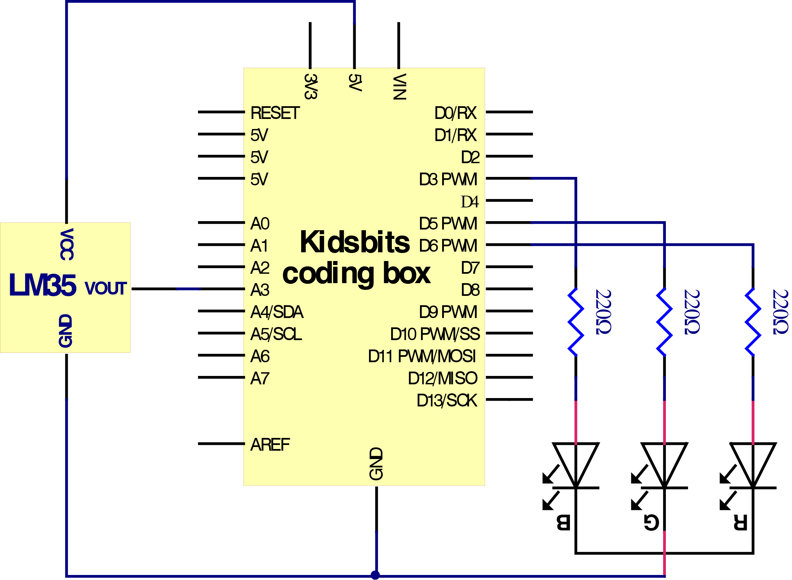

**Project Code**

~~~~~~~~~~~~~~~~~~~~~~~~~~~~~~~~~~~~~~~~~~~~~~~~~~~~~~~~~~~~~~~~~~~~~~~~~~~~~~~~
  \*Kidsbits Coding Box

  Project 16.2

  Temperature tester

  http//www.kidsbits.cc

  */

  int redpin = 6; //select the pin for the red LED

  int greenpin =5;// select the pin for the green LED

  int bluepin =3; // select the pin for the blue LED

  void setup()

  {

  pinMode(redpin, OUTPUT);

  pinMode(bluepin, OUTPUT);

  pinMode(greenpin, OUTPUT);

  Serial.begin(9600);//Set Baud Rate to 9600 bps

  }

  void loop()

  { unsigned int val;

  unsigned int dat;

  val=analogRead(3);//Connect LM35 on Analog 3

  dat=(500 val) /1024;

  Serial.print("Temp:"); //Display the temperature on Serial monitor

  Serial.print(dat);

  Serial.println("C");

  if (dat \>= 50) {

  digitalWrite(greenpin, LOW);

  digitalWrite(bluepin, LOW);

  digitalWrite(redpin, HIGH);

  }

  else if (dat \>= 30 && dat \< 50) {

  digitalWrite(greenpin, LOW);

  digitalWrite(bluepin, HIGH);

  digitalWrite(redpin, LOW);

  }

  else {

  digitalWrite(greenpin, HIGH);

  digitalWrite(bluepin, LOW);

  digitalWrite(redpin, LOW);

  }

  delay(200);

  }

  //////////////////////////////////////////////////////////////////
~~~~~~~~~~~~~~~~~~~~~~~~~~~~~~~~~~~~~~~~~~~~~~~~~~~~~~~~~~~~~~~~~~~~~~~~~~~~~~~~

**Project Result**

After uploading the code to the coding box, the temperature sensor can detect
the outside temperature.

When the temperature is greater than or equal to 50°C, the RGB LED lights up
red;

When the temperature is greater than or equal to 30°C and less than 50°C, the
RGB LED lights up green;

When the temperature is less than 30°C, the RGB LED lights up blue,

You can use this item to make a temperature reminder water cup.

**next project**\*\*\*

### Project 17 Turns An LED On\*\*

**Project Introduction**

Dot matrices seem to be very unfamiliar, but in fact it is everywhere in our
lives. It is widely used in some outdoor billboards, game consoles, and
supermarkets.

And a LED dot matrix has many advantages, such as power saving, long service
life, low cost, high brightness, wide viewing angle, long visual range,
waterproof and so on. It can meet different needs, so it has great prospects.

The 88 dot matrix integrated on the coding box uses I2C communication. It can
control up to 64 LEDs and display interesting patterns, including numbers,
characters, and graphics with only two signal pins.

What’s more, the 88 dot matrix is equipped with a HT16K33 driver chip .Through a
simple I2C interface, we can control the chip to work and drive the 88 dot
matrix screen.

Now we are about to start many 88 dot matrix projects. Firstly, let’s turn on a
led on the dot matrix.

**Project Circuit：**

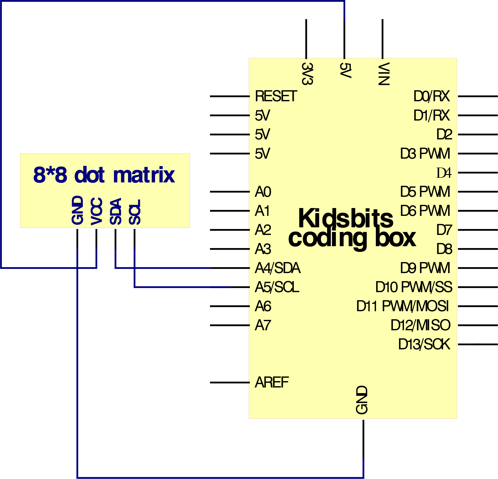

**Project Principle：**

The theory behind the 88 dot matrix is quite simple. It is driven by the chip
HT16K33 of the micro-controller. It has 64 LEDs, sitting in 8 rows and 8
columns. In order to locate these LEDs quickly, as the figure shown below, we
can regarded this matrix as a coordinate system and create two aces by marking
those in rows from 0 to 7 from bottom to top, and the ones in columns from 0 to
7 from the left to the right.

Then,what we should do to light a LED ?

Please have a look at the following picture.

According to coordinate system created, the red spot in the above picture can be
recorded as (3,2). Then we integrate its position into the code to write the
following code.

**Project Code：**

~~~~~~~~~~~~~~~~~~~~~~~~~~~~~~~~~~~~~~~~~~~~~~~~~~~~~~~~~~~~~~~~~~~~~~~~~~~~~~~~
  \*Kidsbits Coding Box

  Project 17

  88 dot matrix-turn on a LED

  http//www.kidsbits.cc

  */

  \#include \<ks_Matrix.h\>

  Matrix myMatrix(A4,A5);

  void setup() {

  myMatrix.begin(112);

  myMatrix.clear();

  }

  void loop() {

  myMatrix.drawPixel(3,2,HIGH);

  myMatrix.writeDisplay();

  }
~~~~~~~~~~~~~~~~~~~~~~~~~~~~~~~~~~~~~~~~~~~~~~~~~~~~~~~~~~~~~~~~~~~~~~~~~~~~~~~~

**Project Result:**

Upload the code to the coding box successfully, the LED dot matrix will display
the required LED as shown in the figure below.

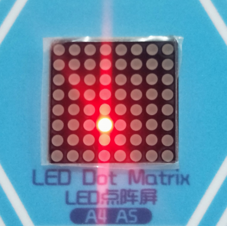

**next project**\*\*\*

### Project 18 Turn On A Line\*\*

**Project Introduction**

In the previous project, we have turned on one LED while in this lesson we will
light a row of LEDs, that’s 8 LEDs.

**Project Principle：**

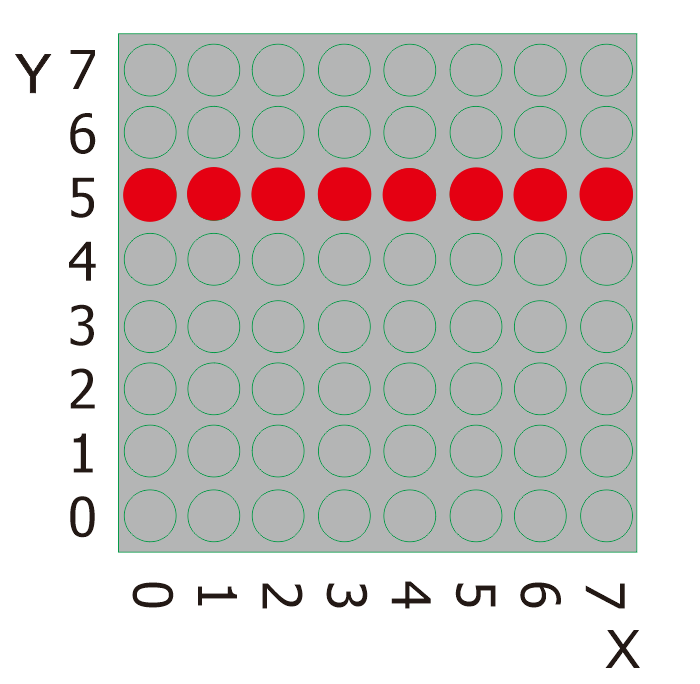

Please look at the above picture. What we can do to light this whole line of red
spots? The solution we resort to is a function, matrix.drawLine. We just need to
input the position of the starting and ending points of this a row of LEDs.

From the figure above, it is clear that the starting point of this line is (0,5)
and the ending point is (7,5). Then we log them and place them into the code.

**Project Code：**

~~~~~~~~~~~~~~~~~~~~~~~~~~~~~~~~~~~~~~~~~~~~~~~~~~~~~~~~~~~~~~~~~~~~~~~~~~~~~~~~
  \*Kidsbits Coding Box

  Project 18

  88 dot matrix-turn on a line

  http//www.kidsbits.cc

  */

  \#include \<ks_Matrix.h\>

  Matrix myMatrix(A4,A5);

  void setup()

  {

  myMatrix.begin(112);

  myMatrix.clear();

  }

  void loop()

  {

  myMatrix.drawLine(0, 5, 7, 5, HIGH);

  myMatrix.writeDisplay();

  }
~~~~~~~~~~~~~~~~~~~~~~~~~~~~~~~~~~~~~~~~~~~~~~~~~~~~~~~~~~~~~~~~~~~~~~~~~~~~~~~~

**Project Result:**

Upload the code to the coding box successfully, the LED dot matrix will display
as shown in the figure below.

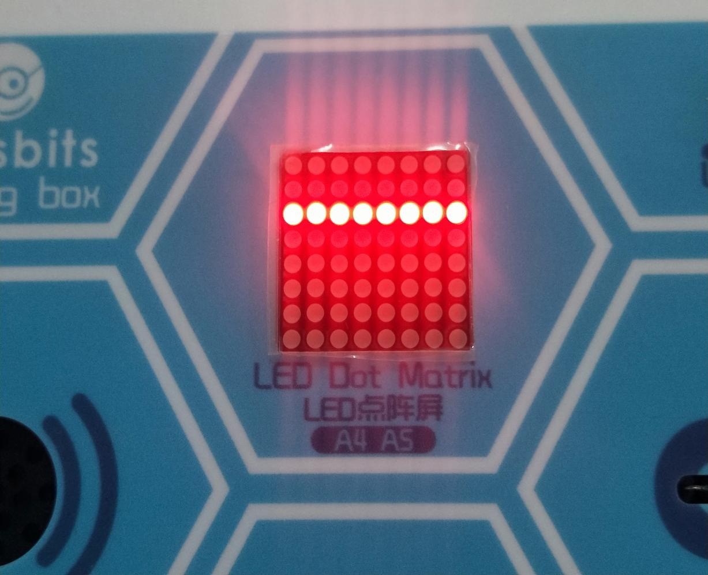

**next project**\*\*\*

### Project 19 Display A Rectangle

**Project Introduction**

Are you getting more excited about our next project?

This time, we intend to make it more challenging and let the matrix display a
rectangle.

**Project Principle：**

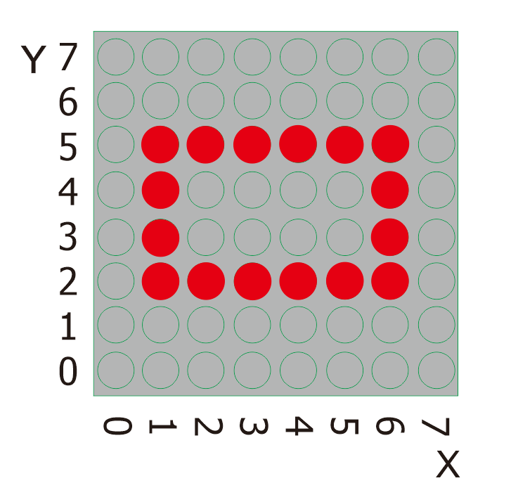

Likewise, please eye the picture above.

What we should do to light all these red spots shaped in a rectangle? Our
solution is another function, matrix.fillRect. With the help of this function,
to showcase a rectangle or a square with these LEDs, we just need to determine
the position of a starting point.

Let’s find the position of the blue spot，the starting point, in the picture
below.

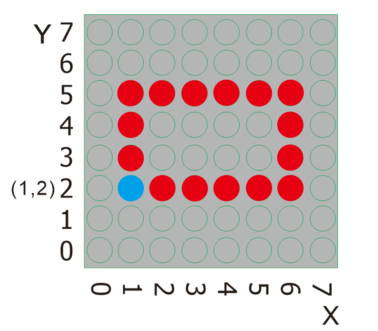

It is explicit that the position of the blue spot is (1,2). To light this
rectangle, what required to do is adding the dimension of the rectangle behind
the position value of this point. Therefore, for this rectangle, it is
(1,2,6,4). Likewise, if we use this blue sport as a starting point to achieve a
square with the dimension of 44, it is (1,2,4,4).

**Project Code：**

~~~~~~~~~~~~~~~~~~~~~~~~~~~~~~~~~~~~~~~~~~~~~~~~~~~~~~~~~~~~~~~~~~~~~~~~~~~~~~~~
  \*Kidsbits Coding Box

  Project 19

  88 dot matrix-turn on a rectangle

  http//www.kidsbits.cc

  */

  \#include \<ks_Matrix.h\>

  Matrix myMatrix(A4,A5);

  void setup() {

  myMatrix.begin(112);

  myMatrix.clear();

  }

  void loop() {

  myMatrix.drawRect(1, 2, 6, 4, HIGH);

  myMatrix.writeDisplay();

  }
~~~~~~~~~~~~~~~~~~~~~~~~~~~~~~~~~~~~~~~~~~~~~~~~~~~~~~~~~~~~~~~~~~~~~~~~~~~~~~~~

**Project Result:**

Upload the code to the coding box successfully, the LED dot matrix will display
the pattern as shown in the figure below.

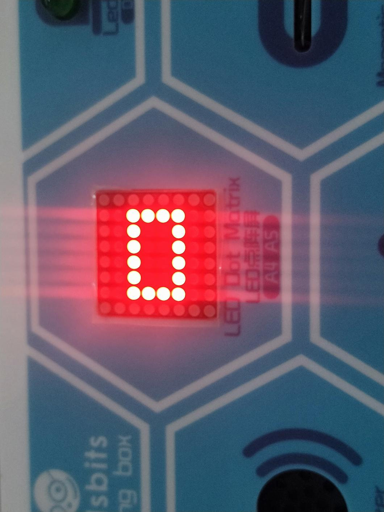

**next project**\*\*\*

### Project 20 Display A Circle

**Project Introduction**

In the previous project, the matrix has shown a rectangle with its LEDs. In this
one, we will help it exhibit a circle. **Working Principle**

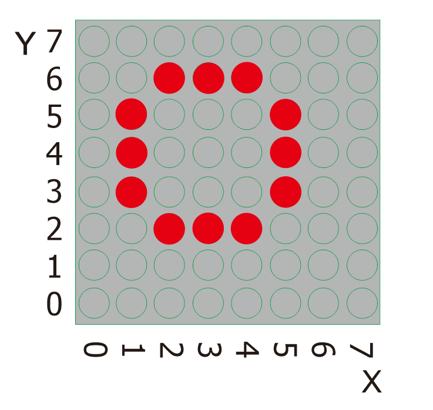

As the picture shown below, the circle we plan to create is 2 units in radius.

However, to achieve this goal by applying the knowledge learned before, we can
only light them one by one, which is very time-consuming. We have a better and
simpler way. That’s come to another function, matrix.drawCircle for help.

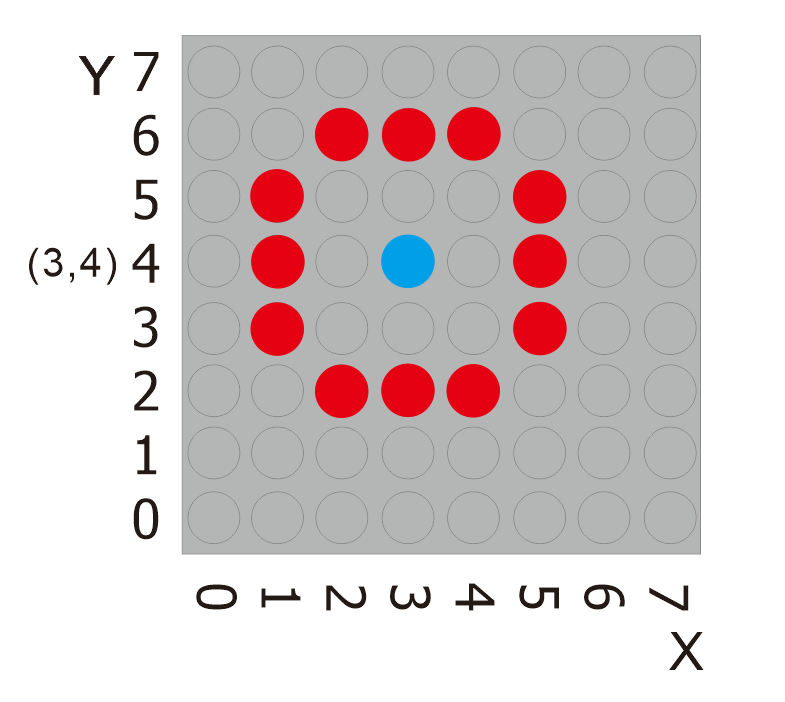

What we should do is to find the central point of a circle and mark its position
as well as record the radius of the circle. In this case, the central point is
(3,4) and the radius is 2 units. We combine these data together to obtain value
(3,4,2) and add it to the code.

Therefore, if we want to draw a circle 3 units in radius with the same point,
just alter the value to(3,4,3).

The following is the code.

**Project Code**

~~~~~~~~~~~~~~~~~~~~~~~~~~~~~~~~~~~~~~~~~~~~~~~~~~~~~~~~~~~~~~~~~~~~~~~~~~~~~~~~
  \*Kidsbits Coding Box

  Project 20

  88 dot matrix-turn on a LED

  http//www.kidsbits.cc

  */

  \#include \<ks_Matrix.h\>

  Matrix myMatrix(A4,A5);

  void setup() {

  myMatrix.begin(112);

  myMatrix.clear();

  }

  void loop() {

  myMatrix.drawCircle(3, 4, 2, HIGH);

  myMatrix.writeDisplay();

  }
~~~~~~~~~~~~~~~~~~~~~~~~~~~~~~~~~~~~~~~~~~~~~~~~~~~~~~~~~~~~~~~~~~~~~~~~~~~~~~~~

**Project Result:**

Upload the code to the coding box successfully, the LED dot matrix will display
as shown in the figure below.

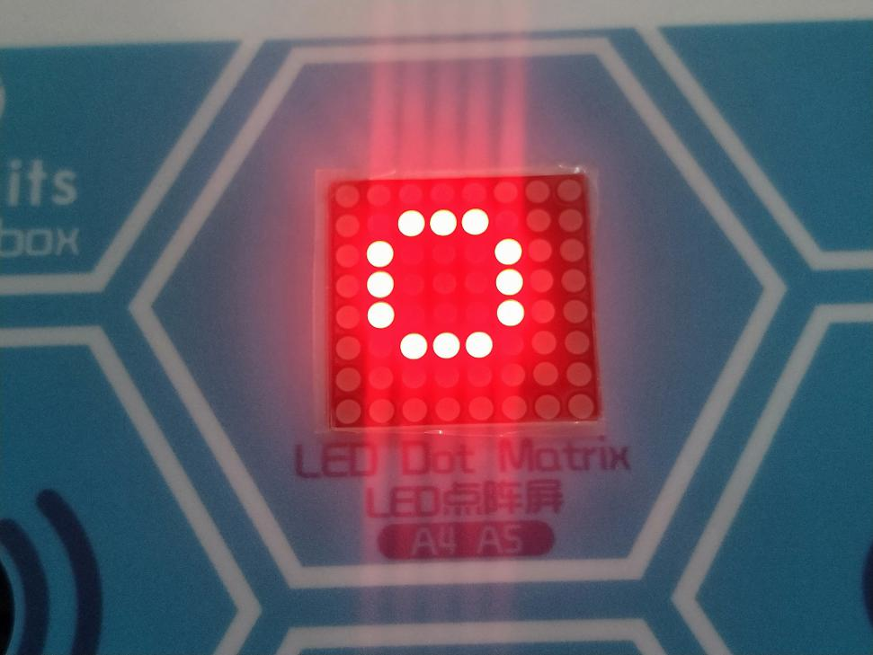

**next project**\*\*\*

### Project 21 Display Text and Numbers

**Project Introduction**

In the previous projects, we just use the matrix to show a point, a line, a
rectangle and a circle. From this one, we will make the matrix to show digits
and characters, which is pretty cool. With this skill, we are able to deliver
information, like what price tags and billboards do.

**Project Principle**

This project is also relatively simple. To render the matrix to display numbers
or characters we need to decide a starting point. For example, in the figure
below, the blue point spot(2,0) is the starting point of the letter K.

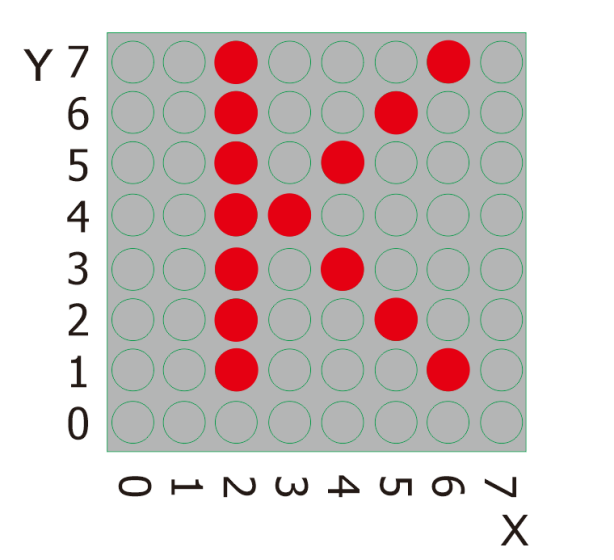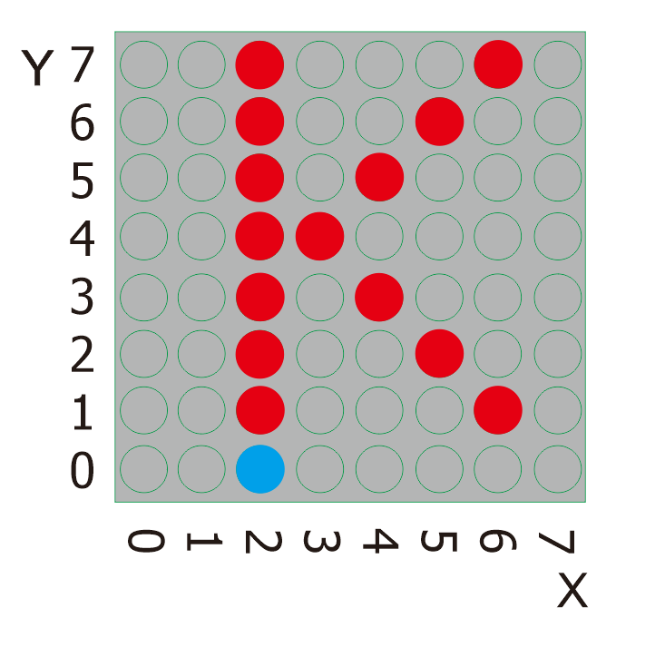

Then we also need to input the position value(2,0) to the code so as to display
the letter K.

**Project Code**

~~~~~~~~~~~~~~~~~~~~~~~~~~~~~~~~~~~~~~~~~~~~~~~~~~~~~~~~~~~~~~~~~~~~~~~~~~~~~~~~
  \*Kidsbits Coding Box

  Project 21

  88 dot matrix-display text and numbers

  http//www.kidsbits.cc

  */

  \#include \<ks_Matrix.h\>

  Matrix myMatrix(A4,A5);

  void setup() {

  myMatrix.begin(112);

  myMatrix.clear();

  }

  void loop() {

  myMatrix.setTextSize(1);//Set the size of characters

  myMatrix.setTextWrap(false); // we dont want text to wrap so it scrolls nicely

  myMatrix.setTextColor(1);

  myMatrix.setRotation(0);// Rotation

  myMatrix.clear();

  myMatrix.setCursor(2,0);//Input the value of the position

  myMatrix.print("K"); //Input characters or letters

  myMatrix.writeDisplay();

  delay(1000);

  }
~~~~~~~~~~~~~~~~~~~~~~~~~~~~~~~~~~~~~~~~~~~~~~~~~~~~~~~~~~~~~~~~~~~~~~~~~~~~~~~~

**next project**\*\*\*

### Project 22 Display Images

**Project Introduction**

Mobile phones, computer screens, billboards and other display devices all
consist of many small luminous units. However, the 88 dot matrix has only 64
luminous units. Though it can't display some nice images with high-resolution,
it can show some cute pictures, such as patterns shaped in little heart, cute
facial expressions, avatars and others.

**Project Principle**

To this end, we will need the help of an online version of dot matrix modulus
tool:<http://dotmatrixtool.com>

Please open the link to enter the following page.

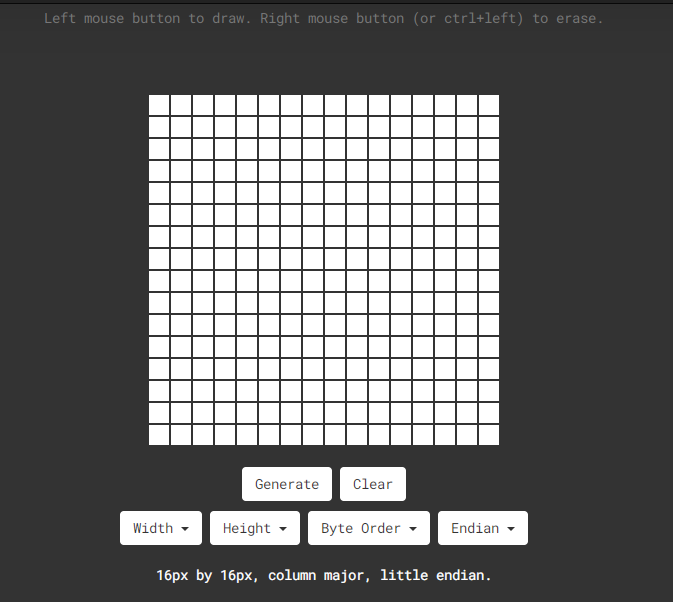

Firstly, as the dot matrix is 88 in this project, please set the height to 8,
width to 8, as shown below.

Secondly, Click the Byte order and then choose Row Major as shown below.

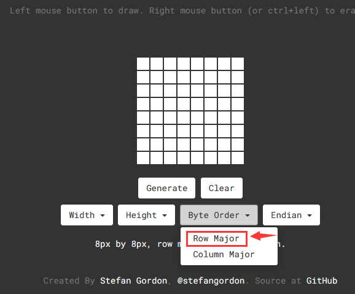

And click the Endian and choose Little Endian(lsb) as shown below;

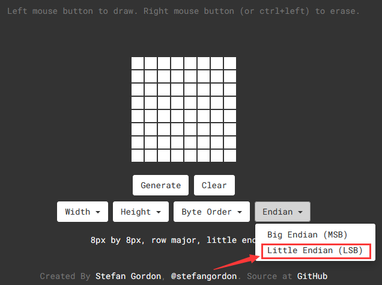

Thirdly, draw the pattern wanted.

Lastly, click **Generate**, to yield the hexadecimal data needed.

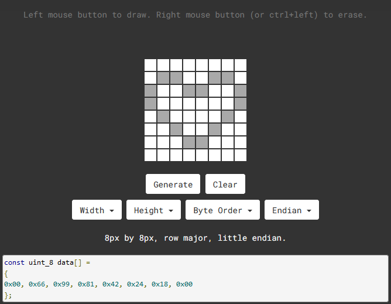

0x00, 0x66, 0x99, 0x81, 0x42, 0x24, 0x18, 0x00

And then integrate the above hexadecimal data into the code

**Project Result**

Upload the code to the coding box successfully, the LED dot matrix will display
as shown in the figure below.

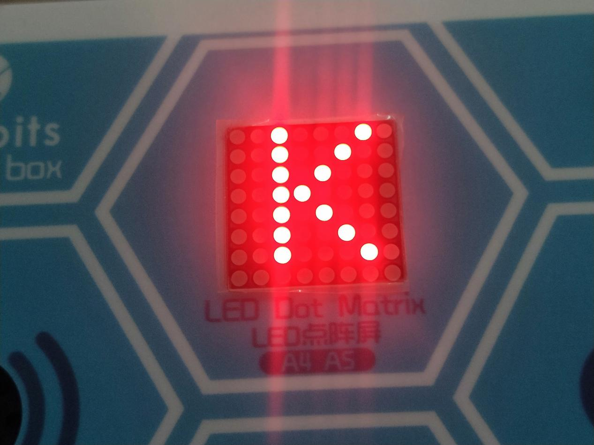

**Project Code**

~~~~~~~~~~~~~~~~~~~~~~~~~~~~~~~~~~~~~~~~~~~~~~~~~~~~~~~~~~~~~~~~~~~~~~~~~~~~~~~~
  \*Kidsbits Coding Box

  Project 22

  88 dot matrix-display images

  http//www.kidsbits.cc

  */

  \#include \<ks_Matrix.h\>

  Matrix myMatrix(A4,A5);

  uint8_t LedArray1[8]={0x00, 0x66, 0x99, 0x81, 0x42, 0x24, 0x18, 0x00};

  uint8_t LEDArray[8];

  void setup(){

  myMatrix.begin(0x70);

  }

  void loop(){

  myMatrix.clear();

  for(int i=0; i\<8; i++)

  {

  LEDArray[i]=LedArray1[7-i];

  for(int j=7; j\>=0; j--)

  {

  if((LEDArray[i]&0x01)\>0)

  myMatrix.drawPixel(j, i,1);

  LEDArray[i] = LEDArray[i]\>\>1;

  }

  }

  myMatrix.writeDisplay();

  }
~~~~~~~~~~~~~~~~~~~~~~~~~~~~~~~~~~~~~~~~~~~~~~~~~~~~~~~~~~~~~~~~~~~~~~~~~~~~~~~~

**Project Result**

Upload the code to the coding box successfully, the LED dot matrix will display
as shown in the figure below.

**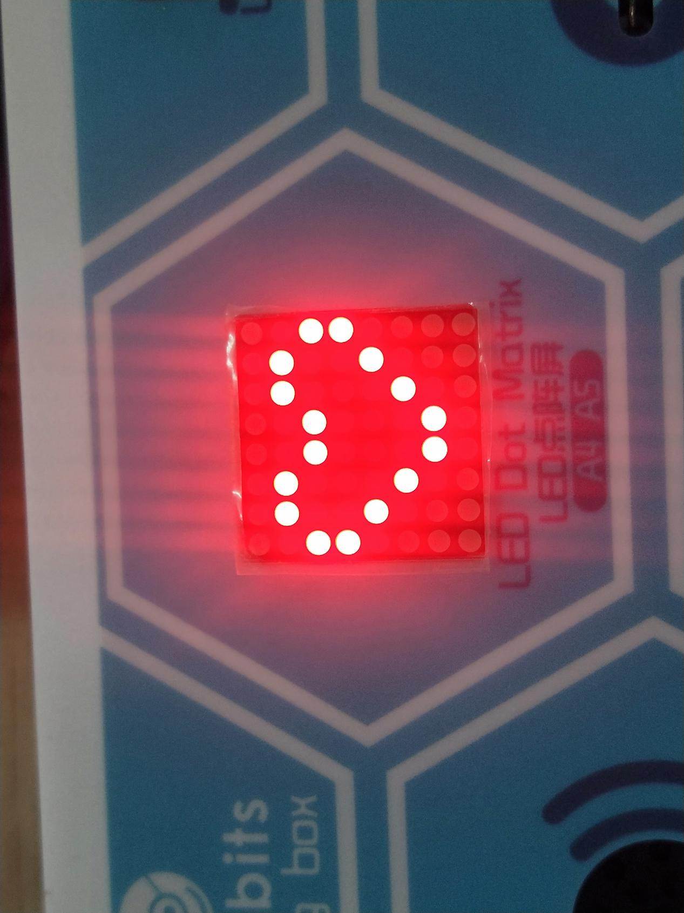**

**next project**\*\*\*

### Project 23 Buttons+88 Dot Matrix

**Project Introduction**

There are two built-in buttons on the MAX board, which we have used to control
DIY lamps in previous project. While in this project, we will combine these
buttons with the 88 dot matrix to make displays.

**Working Principle**

Preciously,we learned that the signal pins of the two buttons should be
connected with D2 and D3 and how to make the matrix to show characters. Bearing
these knowledge in mind, we will complete this project. When the button on the
left side is pressed, the letter L will be displayed while when the right is
pressed, R will be shown.

**Project Circuit**

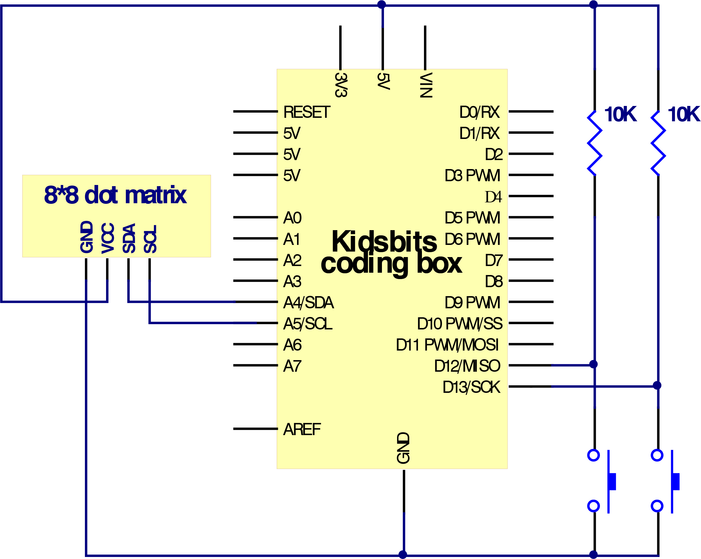

**Project Code**

~~~~~~~~~~~~~~~~~~~~~~~~~~~~~~~~~~~~~~~~~~~~~~~~~~~~~~~~~~~~~~~~~~~~~~~~~~~~~~~~
  \*Kidsbits Coding Box

  Project 23

  88 dot matrix-knob control

  http//www.kidsbits.cc

  */

  \#include \<ks_Matrix.h\>

  Matrix myMatrix(A4,A5);

  int K1=12;

  int K2=13;

  int x;

  void setup()

  {

  myMatrix.begin(112);

  myMatrix.clear();

  pinMode(K1,INPUT);

  pinMode(K2,INPUT);

  myMatrix.drawCircle(3,3, 2, 1);

  myMatrix.writeDisplay(); // write the changes we just made to the display

  }

  void loop()

  {

  int K1_level=digitalRead(K1);

  int K2_level=digitalRead(K2);

  if(K1_level==0)

  {

  myMatrix.setTextSize(1);

  myMatrix.setTextWrap(false); // we dont want text to wrap so it scrolls nicely

  myMatrix.setTextColor(1);

  myMatrix.setRotation(0);

  myMatrix.clear();

  myMatrix.setCursor(2,0);

  myMatrix.print("L");

  myMatrix.writeDisplay();

  }

  if(K2_level==0)

  {

  myMatrix.setTextSize(1);

  myMatrix.setTextWrap(false); // we dont want text to wrap so it scrolls nicely

  myMatrix.setTextColor(1);

  myMatrix.setRotation(0);

  myMatrix.clear();

  myMatrix.setCursor(2,0);

  myMatrix.print("R");

  myMatrix.writeDisplay();

  }}
~~~~~~~~~~~~~~~~~~~~~~~~~~~~~~~~~~~~~~~~~~~~~~~~~~~~~~~~~~~~~~~~~~~~~~~~~~~~~~~~

**Project Result**

A successful uploading of the code to the coding box, the LED dot matrix first
displays a circle; Press the left button and the LED dot matrix displays the
letter "L";Press the right button and the LED dot matrix displays the letter
"R".

| 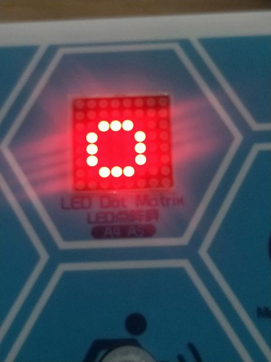 |  |  |
|-------------------------------------------------------------------|-------------------------------------------------------------------|-------------------------------------------------------------------|

**next project**\*\*\*

### Project 24 Light Sensor+88 Dot Matrix

**Project Introduction**

We have made a night light based on the property of the light sensor that its
resistance decreases with the increasing of the light. In this project, we will
show you something intriguing too. We will combine the matrix with the light
sensor to display the length of the light.

**Project Principle**

The signal pin of the light sensor is wired with the A6 of the MAX development
board. And the light column displayed on the 88 dot matrix will change with the
external light detected by the light sensor. When the detected light is darker,
the light column displayed is shorter; when the light becomes brighter, the
light column gets longer;

**Project Circuit**

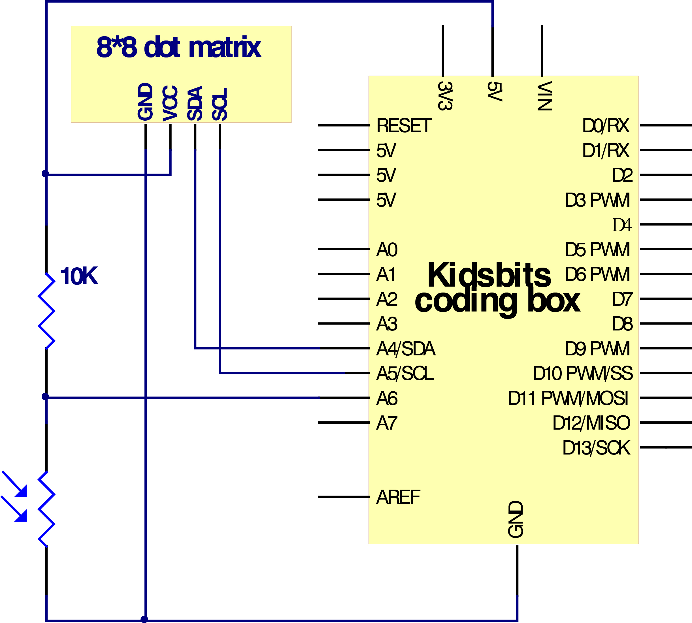

**Project Code**

~~~~~~~~~~~~~~~~~~~~~~~~~~~~~~~~~~~~~~~~~~~~~~~~~~~~~~~~~~~~~~~~~~~~~~~~~~~~~~~~
  \*Kidsbits Coding Box

  Project 24

  88 dot matrix-light control

  http//www.kidsbits.cc

  */

  \#include \<ks_Matrix.h\>

  Matrix myMatrix(A4,A5);

  int light = A6;

  int Light_val;

  void setup() {

  pinMode(A6,INPUT);

  myMatrix.begin(112);

  myMatrix.clear();

  }

  void loop() {

  Light_val=analogRead(A6);

  Light_val=map(Light_val,0,1023,0,15);

  myMatrix.clear();

  myMatrix.drawLine(3,0, 3,Light_val, 1);

  myMatrix.writeDisplay(); // write the changes we just made to the display

  delay(10);

  }
~~~~~~~~~~~~~~~~~~~~~~~~~~~~~~~~~~~~~~~~~~~~~~~~~~~~~~~~~~~~~~~~~~~~~~~~~~~~~~~~

**Project Result**

After uploading the code to the coding box, the LED dot matrix displays a line
when the sensor detect light. And when the light sensor is blocked, the height
of the dot matrix decreases.The stronger the light detected by the light sensor,
the higher the height of the dot matrix displays.

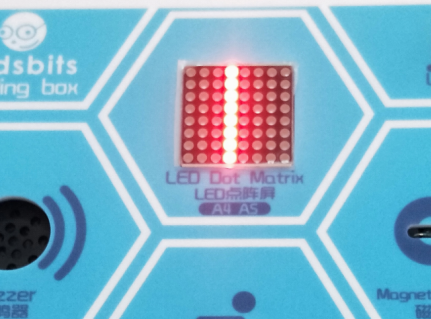
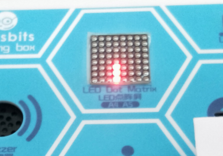

**next project**\*\*\*

### Project 25 Sound Sensor+88 Dot Matrix

**Project Introduction**

Previously, we used a sound sensor and LED to make a voice-controlled lamp. Here
we will use the sound sensor and the 88 dot matrix to interact together and do
some interesting projects.

**Working Principle**

The signal pin of the sound sensor is connected with the A2 on the MAX
development board. And the cycle displayed on the matrix can get bigger as the
sound sensed increases.

**Project Circuit**

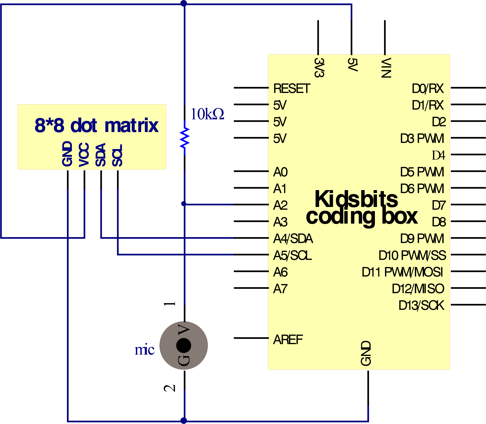

**Project Code**

~~~~~~~~~~~~~~~~~~~~~~~~~~~~~~~~~~~~~~~~~~~~~~~~~~~~~~~~~~~~~~~~~~~~~~~~~~~~~~~~
  \*Kidsbits Coding Box

  Project 25

  88 dot matrix-sound control

  http//www.kidsbits.cc

  */

  \#include \<ks_Matrix.h\>

  Matrix myMatrix(A4,A5);

  int mic = A2;

  int Mic_val;

  void setup() {

  pinMode(mic,INPUT);

  myMatrix.begin(112);

  myMatrix.clear();

  }

  void loop() {

  Mic_val=analogRead(mic);

  Mic_val=map(Mic_val,0,1023,0,10);

  myMatrix.clear();

  myMatrix.drawCircle(3,3,Mic_val, 1);

  myMatrix.writeDisplay(); // write the changes we just made to the display

  delay(10);

  }
~~~~~~~~~~~~~~~~~~~~~~~~~~~~~~~~~~~~~~~~~~~~~~~~~~~~~~~~~~~~~~~~~~~~~~~~~~~~~~~~

**Project Result**

After uploading the code to the coding box, we find that the LED dot matrix
displays a dot when the sound sensor detects a sound. When the sound is loud
enough, the LED dot matrix displays a circle with a dot as the center. The
louder the sound, the larger the circle.

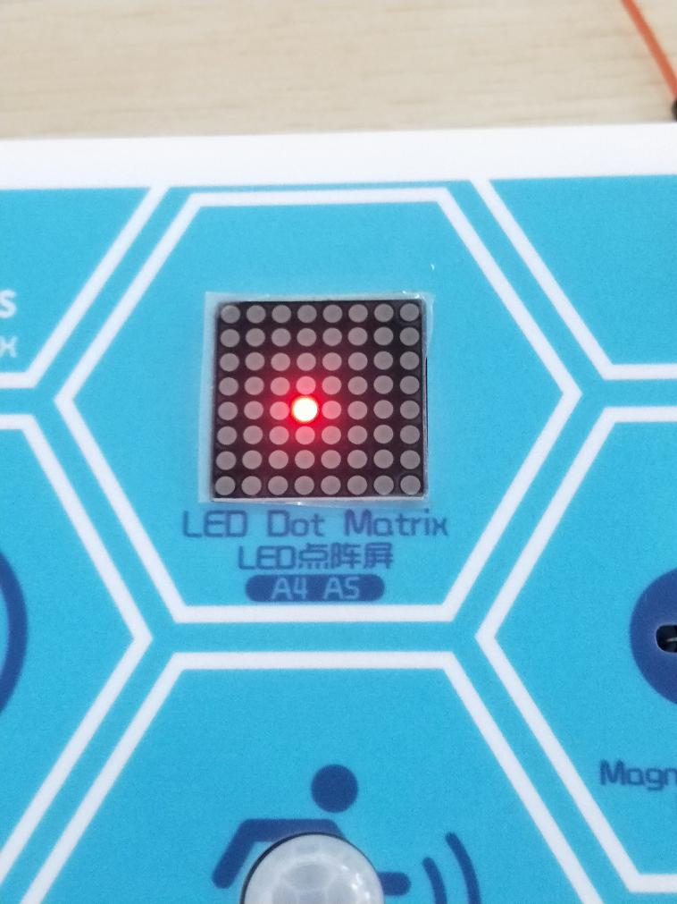
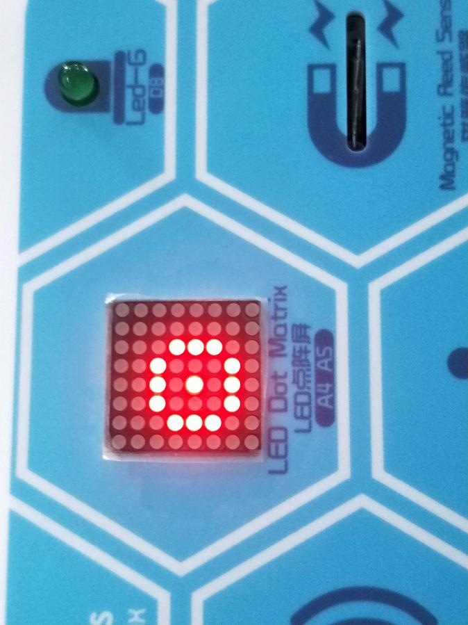
