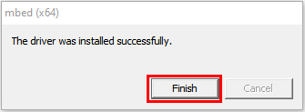
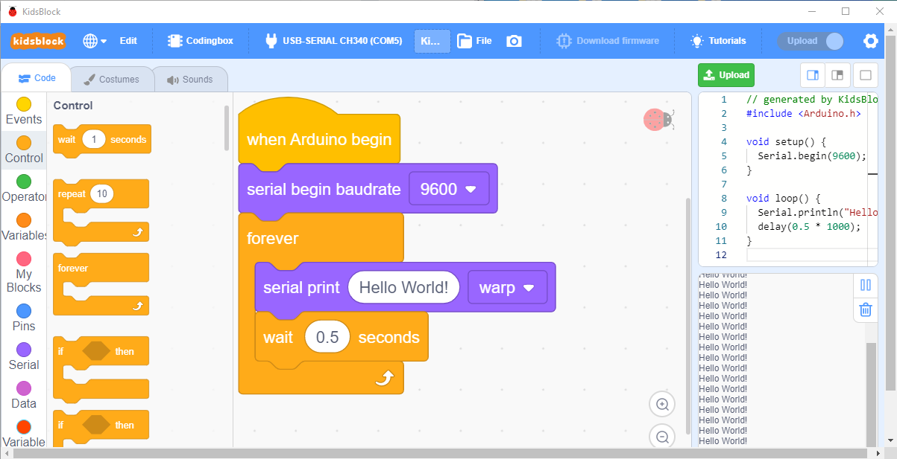
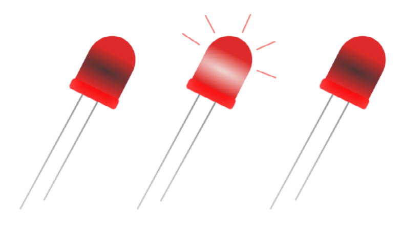
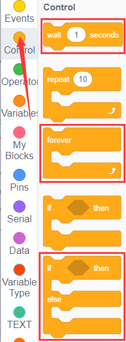
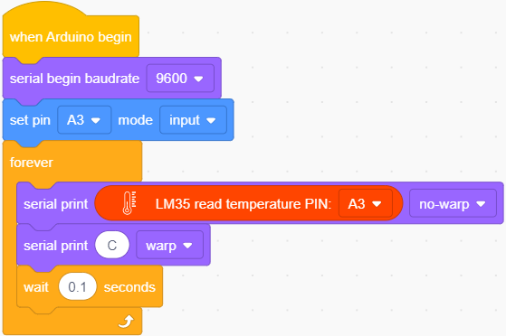
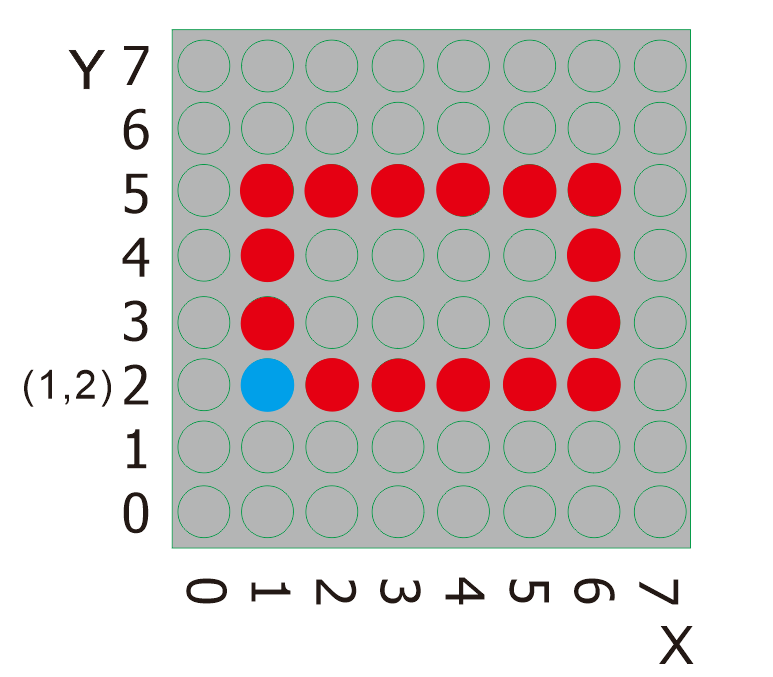
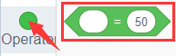

# kidsblock tutorial

## Getting started with kidsblock

**Instruction**

The Kidsblock, based on the Scratch graphical programming software, integrates multiple mainstream mainboards, sensors as well as modules. It can be programmed by dragging graphical blocks and using the C/C++ programming language, making programming easy and interesting for children to learn.

**Download and install KidsBlock software**

**[Windows system](https://www.kidsblock.cn/Down/KidsBlock.exe)**

**[MACOS system](https://www.kidsblock.cn/Down/KidsBlock-MACOS.dmg)**

**How to use KidsBlock**

Interface

Clickto switch to different languages

3\. Clickto select“**Install driver**”.

Note: If the driver is not installed, as shown below;

Click “Next” at the **Device Driver Installation Wizard** page.

After a while, click“Finish”

Then click“Next”.

And click“Finish”.

Then click“**Allow**”and“**Install**”

After a while，click“Finish”

Select“Extract”

Click“**Next**”

Next, click“**I accept this agreement**”and“**Next**”

Click“Finish”.

After a while, click“**INSTALL”**

After a few seconds, when the driver is installed, just click“**OK**”

Click  to enter the main page, select the control board needed. In this project, we select“**Codingbox**”and click **Connect,** then it is connected.

Click **Go to Editor** to return the code editor.

Icon  will change into  and will change into . This means the **Codingbox** and ports（COM）are connected.

If the“**Codingbox**” is connected , but icon doesn’t change into . You need to click to connect the COM port.

Click  and **Connect.**

Then you will find a page pop up, showing **Connected.**

To disconnect the port, just click  and **Disconnect**

Note: if you want to update libraries of KidsBlock, click  then Clear cache and restart

How to open SB3 type files：

1：Double-click SB3 type files to open them.

For instance, open , then we need to double-click .

Open Kidsblock，click **file and Load from your computer**，then select the SB3 type file on the computer.（for example ）

## Projects

### Project 01:Hello,World!

**Project Introduction**

As for starters, we will begin with something simple. In this project, you only need a Mainboard and a USB cable to start the "Hello World!" project. It is not only a communication test of your Arduino and PC, but also an enlightening project for you to have your first try in the Arduino world!

**Project Code**

After installing driver for Scratch, let's open Scratch software and compile code that enables Scratch to print "Hello World!" .

Look for Code Blocks

You can drag blocks to edit. Blocks listed below are for your reference

Complete Program

**Project Result**

Click  to upload the program, after uploading it successfully, clickto set the baud rate to 9600, then the serial monitor will print “Hello World!”.

### Project 02: Blink

**Project Introduction**

In this project, we start to learn the digital output of Arduino. We will use the digital pin of Arduino to turn on an LED and let it blink.

**Working Principle**

LED is a type of semiconductor called "Light Emitting Diode "which is an electronic device made from semiconductor materials (silicon, selenium, germanium, etc.). It is dubbed indicator, digital and word display in circuit and device. It has positive and negative poles. The short leg is the negative pole, and the long one is the positive pole. 

**Circuit Connection**

**Project Code**

Look for Code Blocks

You can drag blocks to edit. Blocks listed below are for your reference

Complete Program

**Project Result**

Clickto upload the code to the coding box successfully, you can see that the red LED of D7 starts blinking, which is on for 1 second and off for 1 second.

### Project 03: SOS

****

**Project Introduction**

The S.O.S distress signal is an international Morse code distress signal asking for help. Morse code is a character encoding. Each letter of English is composed of different combinations of bars and dots. The advantage of this is that using the simple two symbols all letters and numbers can be transmitted, which is very simple!

**Working Principle**

The letters can be spelled out through the two states of the LED switch, using long flashing and short flashing to indicate dots and bars. Just spell the three letters S.O.S.

By consulting the Morse code table, we can know that the letter "S" is represented by three dots, and we use short blinking instead, and the letter "O" is represented by three horizontal bars, which is replaced by long blinking here.

**Circuit Connection**

**Project Code**

Look for Code Blocks

You can drag blocks to edit. Blocks listed below are for your reference

Complete Program

**Project Result**

Clickto upload the code to the coding box successfully, you can see that the red LED at D7 fast flash 3 times and then slowly flash 3 times alternatively, which can stimulate SOS alarm in Morse code.

### Project 04: PWM

**Project Introduction**

In this project, we will learn the PWM control of ARDUINO. PWM is the abbreviation of Pulse Width Modulation, which is a technology that encodes analog signal level into digital signal level. We will use PWM to control an LED gradually from bright to dark.

**Working Principle**

The PWM signal stands for Pulse Width Modulation, and is a technique for controlling the brightness of the LED and the speed of the DC motor and servo motor. The Arduino digital pins either produce 5V(when turned high) or 0V(when turned low).

However, PWM outputs a square wave signal. So if we want to dim the LED, we can't get the voltage between 0 and 5V from the digital pins, but we can change the ON (on) and OFF (off) times of the signal. If we will change the on and off time fast enough, then the brightness of the led will change.

Output voltage = (turn on time/pulse time) \* maximum voltage value

PWM has many applications like lamp brightness regulating, motor speed regulating, sound making, etc.

The following are the three basic parameters of PMW.

Duty cycle: The percentage of time when the signal is at a high level during a certain period of time

2\. The pulse period (The reciprocal of pulse frequency in one second)

3\. The voltage level（such as 0V-5V）

There are 6 PMW interfaces on Arduino, namely digital pin 3, 5, 6, 9, 10, and 11.

**3. Circuit Connection**

**Project Code**

Look for Code Blocks

You can drag blocks to edit. Blocks listed below are for your reference

Complete Program

 

**Project Result**

Clickto upload the code to the coding box successfully, you can see the blue light in the RGB on the coding box constantly brightening and dimming, just like a breathing light.

### Project 05: RGB

**Project Introduction**

In this project, we will introduce RGB to you and show you how to control it to emit different colors of light.

**Working Principle**

The RGB color mode is a color standard in the industry. It obtains various colors by changing the three color channels of red (R), green (G), and blue (B) and integrating them. RGB denotes the three colors of red, green and blue.

The monitors mostly adopt the RGB color standard, and all the colors on the computer screen are composed of the three colors of red, green and blue mixed in different proportions.

And we could adjust the LED brightness by PWM.

**Circuit Connection**

**Project Code**

Look for Code Blocks

You can drag blocks to edit. Blocks listed below are for your reference

Complete Program

**Project Result**

Clickto upload the code to the coding box successfully, you can see the light of the RGB light on the coding box, and the color keeps changing.

### Project 06: Play Music

**Project Introduction**

In the previous , you had heard about active buzzers, which can only emit one sound,and it's very monotonous.

In this program we're going to take you to learn a passive buzzer, which can emit sounds of different frequencies. This characteristic allows the buzzer to play music melody.

The buzzer on the programming box is a passive buzzer.

**Working Principle**

Passive buzzer is an integrated electronic buzzer without vibration source inside. It must be driven by 2K-5K square wave instead of direct current signals.

There is little difference between the two kinds of buzzers, but when the pins of the two buzzers are placed up, the passive buzzer comes with green circuit board, and the one sealed with vinyl is an active buzzer.

**Circuit Connection**

**Project Code**

Look for Code Blocks

You can drag blocks to edit. Blocks listed below are for your reference

Complete Program

**Project Result**

Clickto upload the code to the coding box successfully, you can hear the buzzer playing the song "Ode to Joy" on the coding box

### Project 07: Small Desktop Lamp

**Project Introduction**

The button switch is an electronic switch. When we press the button, the switch function will be turned on. When the pressure is removed, the switch will be turned off. Its internal structure can be realized by changing the force of the metal shrapnel.

In this project, we will use a button switch and an LED to make a small desk lamp project. Press the button can turn on and turn off the LED.

**Working Principle**

I believe that button switch is common and popular for people. It belongs to switch quantity( digital quantity)component. Composed of normally open contact and normally closed contact, its working principle is similar to ordinary switches.

When the normally open contact bears pressure, the circuit is on state ; however, when this pressure disappears, the normally open contact goes back to initial state, that is, off state. The pressure is the act we switch the button.

**Schematic Diagrams:**

 

**Circuit Connection**

**Project Code**

Look for Code Blocks

You can drag blocks to edit. Blocks listed below are for your reference

Complete Program

**Project Result**

Clickto upload the code to the coding box successfully, when the button at D12 is pressed once, the light at D7 will be on; when the button is pressed again, the light at D7 goes out, the same working situation as the desk lamp.

### Project 08: PIR Motion Alarm

****

**Project Introduction**

PIR motion sensor can detect infrared signals from a moving person or moving animal, and output switching signals. It can be applied to a variety of occasions to detect the movement of human body.

For example, in the corridor at night, the PIR motion sensor senses someone going upstairs, and the light turns on automatically, which is not only practical but also environmentally friendly.

**PIR Motion Sensor Specification**

-   Input Voltage 3.3 \~ 5V (6V Maximum)
-   Working Current 15uA
-   Working Temperature -20 \~ 85 ℃
-   Output Voltage High 3V, Low 0V
-   Output Delay Time (High Level) About 2.3 to 3 Seconds
-   Detection Angle 100 °
-   Detection Distance 7 meters
-   Output Indicator LED (When output HIGH, it will be ON)
-   Pin limit Current 100mA
**Circuit Connection**

**Project Code**

Look for Code Blocks

You can drag blocks to edit. Blocks listed below are for your reference

Complete Program

**Project Result**

Clickto upload the code to the coding box successfully,when the human infrared sensor detects people moving nearby,the LED starts flashing, the buzzer sounds. If no one is detected nearby, the LED is off and the buzzer does not sound.

### Project 09: Reed Switch

**Project Introduction**

Reed switch is basically an electrical switch which is operated when a magnetic field is brought near to it. It is made up of two small metal pieces kept inside a glass tube under vacuum. In a typical reed switch, two metal pieces will be made of a ferromagnetic material and covered with rhodium or ruthenium to give them long life. The switch will be activated when there is a presence of magnetic field around the switch.

Reed switch is used in many of the real-life applications such as magnetic door switch, laptops, smart phones etc.

**Sensor Specification**

There are two types of reed switch:

①Normally open reed switch

②Normally closed reed switch

In normally open reed switch, switch is open in the absence of magnetic field and it is closed in the presence of magnetic field. Under the presence of magnetic field, two metal contacts inside the glass tube attract each other to make contact.

In normally closed reed switch, switch is closed in the absence of magnetic field and it is open in the presence of magnetic field.

The glass enclosure of the two metal pieces protect them from dirt, dust and other particles. Reed switch can be operated in any environment such as environment where flammable gas is present or environment where corrosion would affect open switch contacts.

**Circuit Connection**

**Project Code**

Look for Code Blocks

You can drag blocks to edit. Blocks listed below are for your reference

Complete Program

**Project Result**

Clickto upload the code to the coding box successfully,when the magnetic reed detects nearby magnetic force, the LED lights up. If no magnetic force is detected, the LED is off.

### Project 10: DC motor

**Project Introduction**

With this coding box, we can make our own adjustable fan. Usually a simple electric fan is made up of blades, a motor and a switch. You can see a motor fan module on the kidsbits coding box. The motor is actually the electric motor. If there is electricity, the fan blade will rotate. The motor with the fan blade is also called a fan module. Inputting HIGH or LOW level to two pins of fan module, we can make the fan rotate.

**Connection Diagram**

So set to D10, LOW, D11 to HIGH. Upload the code and the motor fan will turn clockwise. If we set the D10 to HIGH, D11 to LOW, the fan will turn anticlockwise. If we set to D10 and D11 to LOW, the fan won’t turn.

Now, we’ve known how to control fan. But how about making fan rotate slowly? Here we can use PWM pins.

PWM pins can steadily output the HIGH and LOW level, and can continuously change HIGH or LOW in a regular time period. The D10 and 11 of motor fan are PWM pins. We can adjust the motor’s speed via PWM pins.

**Project Code**

Look for Code Blocks

You can drag blocks to edit. Blocks listed below are for your reference

Complete Program

**Project Result**

Clickto upload the code to the coding box successfully, the motor on the coding box rotates clockwise for 1 second, with a delay of 3 seconds. Then turn counterclockwise for 1 second, delay 3 seconds, and loop.

### Project 11: Servo

**Project Introduction**

Servo is a position (angle) servo drive, which is suitable for those control systems that require constant angle changes and can be maintained. It has been widely used in remote control toys, airplane models, submarine models, and remote control robots.

In this project, we use the servo rotation angle change to DIY a car speed dial. You can intuitively understand the servo's movement trajectory.

**Working Principle**

Servo is composed of rudder disc, position feedback potentiometer, reduction gear set, DC motor and control circuit.

The reduction gear set is driven by a DC motor, and its output shaft drives a position feedback potentiometer with linear proportional characteristics as position detection.

According to the feedback voltage of the potentiometer, the control circuit compares with the external input control pulse, generates a correction pulse, controls and drives the DC motor to rotate forward or reverse, so that the output position of the reduction gear is combined with the desired value. So as to achieve the purpose of accurately controlling the steering angle.

Servo's control pulse cycle is 20ms, and the pulse width ranges from 0.5ms to 2.5ms, corresponding to positions from -90 degrees to +90 degrees, taking a 180 degree angle servo as an example

Servo motor comes with many specifications. But all of them have three connection wires, distinguished by brown, red, orange (different brand may have different color).

Brown one is for GND, red one for power positive, orange one for signal line.

**Connection Diagram**

**Project Code**

Look for Code Blocks

You can drag blocks to edit. Blocks listed below are for your reference

Complete Program

**Project Result**

Clickto upload the code to the coding box successfully,the servo rotates, the angle starts from 0°, increases by 45° every 0.5 seconds, and when it reaches 180°, it turns to the 0° position.

### Project 12: Potentiometer

**Project Introduction**

The potentiometer is an electronic component that we are very familiar with. It is an analog component. The switch for adjusting the volume on the electrical appliance and the button for adjusting the wind on the fan are all applications of the potentiometer.

In this project, we are going to learn how to use Arduino to read the value of the potentiometer, and then cooperate with the LED light to make a Dimming table lamp.

**Features**

Adjustable potentiometer is just a kind of resistor. The resistance is changed by rotating the potentiometer, so is the voltage, speed, brightness and temperature. It is an analog electronic component, which has two states of 0 and 1(high level and low level). The analog quantity is different. Its data state presents a linear state such as 1 to 1000.

**Read Values**

We connect the adjustable potentiometer to the analog pin of Arduino to read its value. Please refer to the following wiring diagram for wiring.

Look for Code Blocks

You can drag blocks to edit. Blocks listed below are for your reference

Complete Program

**Project Result 1**

Clickto upload the code to the coding box successfully，then click  to set the baud rate to 9600. When you rotate the potentiometer knob, you can see the displayed value change. The reading of analog value is a very common function since most sensors output analog value. After calculation, you can get the corresponding value you need.

Below figure shows the analog value it reads.

**Circuit Connection**

In the last step, we read the value of the potentiometer, and now we need to convert the value of the potentiometer into the brightness of the LED to make a small desk lamp with adjustable brightness. See the wiring diagram.

**Project Code**

Look for Code Blocks

You can drag blocks to edit. Blocks listed below are for your reference

Complete Program

**Project Result 2**

Clickto upload the code to the coding box successfully，you can control the brightness of the red LED in the RGB through the potentiometer.

### Project 13: Light

**Project Introduction**

Photocell is a resistor whose resistance varies from different incident light strength. It's based on the photoelectric effect of semiconductor. If the incident light is intense, its resistance reduces; if the incident light is weak, the resistance increases.

We use the characteristics of Photocell to make a light-controlled table lamp. When the light is dimmed, the light turns on.

**Photocell Little Knowledge**

Photocell is commonly applied in the measurement of light, light control and photovoltaic conversion (convert the change of light into the change of electricity).

Photocell is also being widely applied to various light control circuits, such as light control and adjustment, optical switches, etc.

We will start with a relatively simple experiment regarding to photovaristor application.

Photocell is an element that can change its resistance as light strength changes. So we need to read the analog value. You can refer to the PWM experiment, replacing the potentiometer with photocell\`.

When there is change in light strength, it will make corresponding change on the LED.

**Read Photocell values**

We first use a simple code to read the value of the photocell, print it in the serial monitor, and wire it as shown below.

Look for Code Blocks

You can drag blocks to edit. Blocks listed below are for your reference

Complete Program

**Project Result 1**

Clickto upload the code to the coding box successfully，then clickto set the baud rate to 9600，and you can read the current photocell value. We put our hands on the photocell, and the value became smaller.

**Circuit Connection**

We made a small dimming table lamp before, and now we want to make a light-controlled small table lamp. The basic principles of the two are the same. Both are obtained by obtaining the analog value of the sensor and then adjusting the brightness of the LED.

**Project Code**

Look for Code Blocks

You can drag blocks to edit. Blocks listed below are for your reference

Complete Program

**Project Result 2**

Clickto upload the code to the coding box successfully，the photoresistor can detect the intensity of the light. The brighter the light, the brighter the red LED in RGB.

### Project 14: Sound

**Project Introduction**

The sound sensor is a common sensor. It has a built-in capacitive electret microphone and power amplifier. It can be used to detect the sound intensity of the environment.

In this project, we use a sound sensor and a DC motor to make a voice-activated smart fan. When we make a sound, the fan starts.

**Sound Sensor**

Sound sensor is typically used in detecting the loudness in ambient environment. The Arduino can collect its output signal by analog input interface.

The S pin is analog output, that is voltage signal real-time output of microphone. The sensor comes with a potentiometer, so that you can turn it to adjust the signal gain.

It also has a fixed hole so that you can mount the sensor on any other devices. You can use it to make some interactive work, such as a voice operated switch.

**Read Sound Sensor Values**

We first use a simple code to read the value of the sound sensor, print it in the serial monitor, and wire it as shown below.

Look for Code Blocks

You can drag blocks to edit. Blocks listed below are for your reference

Complete Program

**Project Result 1**

Clickto upload the code to the coding box successfully，tap  to set the baud rate to 9600，then blow or clap your hands at the sensor, you can see the sensor's value changes significantly.

**Circuit Connection**

Next, we formally enter this project. We use a sound sensor and a small motor to make a sound-activated fan. Connect to the circuit diagram below.

**Project Code**

Look for Code Blocks

You can drag blocks to edit. Blocks listed below are for your reference

Complete Program

**Project Result 2**

Clickto upload the code to the coding box successfully，the microphone sensor can detect the sound. When the value of the sound is greater than 650, the motor fan starts to rotate. If it does not reach 650, the motor fan does not rotate.

### Project 15: Gas Sensor

**Project Introduction**

MQ-2 Gas Sensor module is useful for gas leakage detecting in homes and industries. It can detect LPG, i-butane, propane, methane, alcohol, hydrogen and smoke.

**Sensor Specification**

Whenever the concentration of gas increases the resistance will decrease (but the current flow will get increased). It leads to change in voltage and it is read at Analog out pin which tells how much gas is concentrated in normal Air. This varied analog voltage is used to calculate the PPM of Gas.

Similarly, the Module has a Digital output (connected with an Op-Amp) along with a Potentiometer. The Threshold/Sensitivity can be adjusted using the Potentiometer. Because to calibrate the sensor to an Idle condition. Once it reaches the threshold, it will produce the output signal at A1 Pin.

Note: All MQ Sensor takes some time to work properly because of the Heater needs to be heated for a while.

**Circuit Connection**

**Project Code**

Look for Code Blocks

You can drag blocks to edit. Blocks listed below are for your reference

Complete Program

**Project Result**

Clickto upload the code to the coding box successfully，the gas sensor can detect combustible gas. After detecting combustible gas, the buzzer will issue an alarm and the light on RGB will be red. If no combustible gas is detected, the buzzer will not make a sound, and the light on it lights up green.

### Project 16: Temperature Tester

**Project Introduction**

LM35 is a common and easy-to-use temperature sensor. It does not require other hardware. You just need an analog port to make it work. The difficulty lies in compiling the code to convert the analog value it reads into Celsius temperature.

In this project, we use a temperature sensor and RGB to DIY a temperature tester. When the temperature sensor touches different temperature objects, the LED lights will show different colors.

**Working Principle**

LM35 is a widely used temperature sensor with many different package types. At room temperature, it can achieve the accuracy of ±1/4°C without additional calibration processing.

LM35 temperature sensor can produce different voltage by different temperature

When temperature is 0 ℃, it outputs 0V; if increasing 1 ℃, the output voltage will increase 10 mv.

The output temperature is 0℃～100℃, the conversion formula is as follows:

**Read temperature value**

We first use a simple code to read the value of the temperature sensor, print it in the serial monitor, and wire it as shown below.

Here, LM35 output is given to analog pin A3 of Mainboard. This analog voltage is converted to its digital form and processed to get the temperature reading.

Look for Code Blocks

You can drag blocks to edit. Blocks listed below are for your reference

Complete Program

**Project Result 1**

Clickto upload the code to the coding box successfully，tap  to set the baud rate to 9600，and then you can read the current temperature value.

**Circuit Connection**

Now use the LM35 temperature sensor and RGB to do a temperature tester. When the temperature tester senses different temperatures, different LEDs will light up. Follow the diagram below for wiring.

**Project Code**

Look for Code Blocks

You can drag blocks to edit. Blocks listed below are for your reference

Complete Program

Note: The temperature value in the program can be changed depending on the situation.

**Project Result**

Clickto upload the code to the coding box successfully，the temperature sensor can detect the outside temperature.

When the temperature is greater than or equal to 35°C, the RGB LED lights up red.

When the temperature is greater than or equal to 30°C and less than 35°C, the RGB LED lights up green;

When the temperature is less than 30°C, the RGB LED lights up blue,

You can use this item to make a temperature reminder water cup.

### Project 17: Turns An LED On

**Project Introduction**

Dot matrices seem to be very unfamiliar, but in fact it is everywhere in our lives. It is widely used in some outdoor billboards, game consoles, and supermarkets.

And a LED dot matrix has many advantages, such as power saving, long service life, low cost, high brightness, wide viewing angle, long visual range, waterproof and so on. It can meet different needs, so it has great prospects.

The 8\*8 dot matrix integrated on the coding box uses I2C communication. It can control up to 64 LEDs and display interesting patterns, including numbers, characters, and graphics with only two signal pins.

What’s more, the 8\*8 dot matrix is equipped with a HT16K33 driver chip .Through a simple I2C interface, we can control the chip to work and drive the 8\*8 dot matrix screen.

Now we are about to start many 8\*8 dot matrix projects. Firstly, let’s turn on a led on the dot matrix.

**Project Circuit：**

**Project Principle：**

The theory behind the 8\*8 dot matrix is quite simple. It is driven by the chip HT16K33 of the micro-controller. It has 64 LEDs, sitting in 8 rows and 8 columns. In order to locate these LEDs quickly, as the figure shown below, we can regarded this matrix as a coordinate system and create two aces by marking those in rows from 0 to 7 from bottom to top, and the ones in columns from 0 to 7 from the left to the right.

Then,what we should do to light a LED ?

Please have a look at the following picture.

According to coordinate system created, the red spot in the above picture can be recorded as (3,2). Then we integrate its position into the code to write the following code.

**Project Code**

Look for Code Blocks

You can drag blocks to edit. Blocks listed below are for your reference

Complete Program

**Project Result**

Clickto upload the code to the coding box successfully，the LED dot matrix will display the required LED as shown in the figure below.

### Project 18: Turn On A Line

**Project Introduction**

In the previous project, we have turned on one LED while in this lesson we will light a row of LEDs, that’s 8 LEDs.

**Project Principle：**

Please look at the above picture. What we can do to light this whole line of red spots?

From the figure above, it is clear that the starting point of this line is (0,5) ,follow by（1,5）,（2,5）,（3，5）,（4,5）,（5，5）,（6,5）and then the ending point is (7,5)，Then we log them and place them into the code.

**Project Code**

Look for Code Blocks

You can drag blocks to edit. Blocks listed below are for your reference

Complete Program

**Project Result**

Clickto upload the code to the coding box successfully，the LED dot matrix will display as shown in the figure below.

### Project 19: Display A Rectangle

**Project Introduction**

Are you getting more excited about our next project?

This time, we intend to make it more challenging and let the matrix display a rectangle.

**Project Principle**

Likewise, please eye the picture above.

What we should do to light all these red spots shaped in a rectangle? We need to light the corresponding LED. To showcase a rectangle or a square with these LEDs, We need to figure out exactly where these points are.

Let’s find the position of the blue spot，the starting point, in the picture below.

It is explicit that the position of the blue spot is (1,2). To light this rectangle, what required to do is adding the dimension of the rectangle behind the position value of this point. Then find the corresponding position X and Y values of LED that need to be lit one by one.

**Project Code**

Look for Code Blocks

You can drag blocks to edit. Blocks listed below are for your reference

Complete Program

**Project Result**

Clickto upload the code to the coding box successfully，the LED dot matrix will display the pattern as shown in the figure below.

### Project 20: Display Images

**Project Introduction**

Mobile phones, computer screens, billboards and other display devices all consist of many small luminous units. However, the 8\*8 dot matrix has only 64 luminous units. Though it can't display some nice images with high-resolution, it can show some cute pictures, such as patterns shaped in little heart, cute facial expressions, avatars and others.

**Project Code**

Look for Code Blocks

You can drag blocks to edit. Blocks listed below are for your reference

Complete Program

**Project Result**

Clickto upload the code to the coding box successfully，the LED dot matrix will display，，，.

### Project 21: Buttons+8*8 Dot Matrix

**Project Introduction**

There are two built-in buttons on the coding box, which we have used to control DIY lamps in previous project. While in this project, we will combine these buttons with the 8\*8 dot matrix to make displays.

**Working Principle**

Preciously,we learned that the signal pins of the two buttons should be connected with D12 and D13 and how to make the matrix to show characters. Bearing these knowledge in mind, we will complete this project. When the button on the left side is pressed,  will be displayed while when the right is pressed,will be shown.

**Project Circuit**

**Project Code**

Look for Code Blocks

You can drag blocks to edit. Blocks listed below are for your reference

Complete Program

**Project Result**

Clickto upload the code to the coding box successfully，

the LED dot matrix first displays ，Press the left button and the LED dot matrix displays . Press the right button and the LED dot matrix displays .

### Project 22: Light Sensor+8*8 Dot Matrix

**Project Introduction**

We have made a night light based on the property of the light sensor that its resistance decreases with the increasing of the light.

In this project, we will show you something intriguing too. We will combine the matrix with the light sensor to display the length of the light.

**Project Principle**

The signal pin of the light sensor is wired with the A6 of the MAX development board. And the light column displayed on the 8\*8 dot matrix will change with the external light detected by the light sensor.

When the detected light is darker, the light column displayed is shorter; when the light becomes brighter, the light column gets longer;

**Project Circuit**

**Project Code**

Look for Code Blocks

You can drag blocks to edit. Blocks listed below are for your reference

Complete Program

**Project Result**

Clickto upload the code to the coding box successfully，then cover the photoresistor with your hand and change the intensity of the light, the LED on the dot matrix will move according to the intensity of the light.

