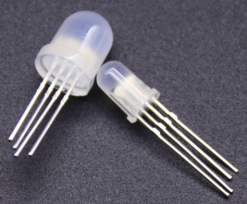
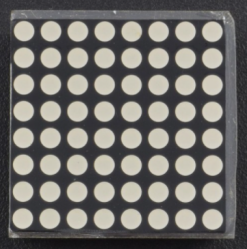
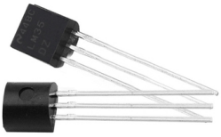
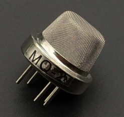
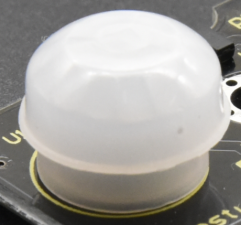
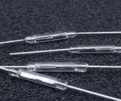

**Coding Box Kit**

**1.Introduction**

Coding Box is a programming learning toolbox based on Arduino, which is a programming tool specially designed for children over 6 years old.

It integrates some of the most basic electronic components and sensors, such as LEDs, buttons, motors, light, sound, infrared and a temperature sensor.

Besides, multitudes of interesting projects can be carried out via the Coding Box, including LED flashing, intrusion alarms, smart fans as well as temperature testers.

Coding Box uses Arduino for programming, and is also compatible with Mixly graphical programming software and Scratch graphical programming software，allowing children to learn from the simplest code and master the system's programming knowledge step by step.

# Component List

| Name                 | Picture                                              | Interface                                        | Summary                                                                                                                                                                                                                                                                                                                                                                                                                                        |
|----------------------|------------------------------------------------------|--------------------------------------------------|------------------------------------------------------------------------------------------------------------------------------------------------------------------------------------------------------------------------------------------------------------------------------------------------------------------------------------------------------------------------------------------------------------------------------------------------|
|      LED             |       |     Connected  to digital pin D7 and D8          | LIGHT-EMITTING DIODES (LEDS) have a positive (+) leg and a negative (-) leg, which make electricity flow through in one direction.  LEDs can also burn out if too much electricity flows through them, so you should use a resistor to limit the high current when you wire an LED into a circuit.  They can be used to make equipment indicator light. Set the signal pin to HIGH, LED will be on; set to LOW, LED will be off.               |
|    RGB               |       |   Connected to PWM digital  pins D6, D5 and D3.  | RGB LED is actually three small LEDs — a red, green and blue LED— inside a normal LED housing.  It has all the internal LEDs sharing the same ground wire, so there are four pins in total.  It can emit many different color, which is. used widely for building lighting and exhibition lighting.                                                                                                                                            |
|   LED Dot Matrix     |       |   Connected to Analog pins A4, A5                | LED Dot Matrix: This tiny display has 64 LEDs packed into a 8\*8 dot matrix. It is great for displaying image/text or creating animations, and is highly portable and convenient to use, which is widely used in train stations, advertising screens and bulletin boards.                                                                                                                                                                      |
|     Servo            |       |    Connected to PWM  digital pin D9              | Servo is a position control rotary actuator. Common servos rotate over a range of about 0°to 180°. It has three wires: one for power, one for grounding and one for signal.  When you send the right signal through the signal wire, the servo will move to a specific angle and stay there. It is widely applied to mechanical arm.                                                                                                           |
|   Buzzer             |       |   Connected to Digital pin D4                    | Buzzer is a consumable component that can generate sound of a specified frequency according to the input signal. It is widely used in alarm, electronic toys, automotive electronics, telephones and other electronic products.                                                                                                                                                                                                                |
|   Motor fan          |       |   Connected to  PWM digital pin D10, D11         | Motor fan module is a consumable component that is connected with a fan blade and a motor (130 DC motor). It can rotate more than 12,000 times per minute, which is widely used in helicopters, windmills, etc.                                                                                                                                                                                                                                |
|    Button            |       |    Connected to digital pin D12, D13             | Button is a component that controls the circuit to turn on and off. When the button is pressed, it sends a high level signal (the Arduino Uno reads 0) to the kidsbits coding box (based on Arduino Uno) through the pins. We can interact with the device by using buttons, such as those used in the course to control the leds on and off.                                                                                                  |
|   Photoresistor      |       |   Connected to Analog pin A6                     | Photoresistor is a light-sensitive and variable resistor, which is an element that changes its resistance as light strength changes.  The stronger the ambient light, the smaller the value output from the pin A.  It is widely applied to various light control circuit, such as optical switches, and smart home system etc.                                                                                                                |
|     Potentiometer    |       |     Connected to analog pin A7                   | Potentiometer (also known as ''trimpot”) is a sensor that controls the output signal of the pin by changing the resistance value.  A potentiometer is a 3-pin variable resistor. When powered with 5V, the middle pin outputs a voltage between 0V and 5V, depending on the position of the knob on the potentiometer.  It is mainly used to set the threshold value in the circuit, or as a controller to control the Servo motion, etc.      |
|     Sound Sensor     |       |     Connected to analog pin A2                   | Sound Sensor is a device which convert energy from one form to another.  A microphone is a transducer which converts sound energy to electrical signals.  The microphones are widely used in electronic circuits to detect minor sounds or air vibrations which in turn are converted to electrical signals for further use.  The top face is covered with a porous material with the help of glue. It acts as a filter for the dust particles |
|   Temperature Sensor |       |   Connected to Analog pin A3                     | Temperature Sensor is a component that can convert the measured temperature signal into a voltage signal output. It is widely used in digital thermometers, medical/home thermometers, portable non-contact infrared temperature thermometers, etc.                                                                                                                                                                                            |
|   Gas Sensor         |       |   Connected to analog pin A1                     | Gas Sensor is a component that can detect the concentration of flammable gases and smoke in the environment. It is widely used in household gas leak alarms, industrial combustible gas alarms and portable gas detectors.                                                                                                                                                                                                                     |
|   PIR Motion Sensor  |       |   Connected to digital pin D2.                   | PIR Motion Sensor is a sensor that uses the characteristics of temperature change to detect infrared radiation. When a person enters its sensing range, it outputs a high level. When the person leaves the sensing range, it automatically delays the high level and outputs a low level, which is widely used in infrared automatic sensor lights, sensor switches, burglar alarms and IR welcome device.                                    |
|   Reed switch        |       |   Connected to analog pin A0.                    | Reed Sensor, also known as reed switch, is an electrical switch operated by an applied magnetic field, which is widely used in household appliances, automobiles, communications, industry, medical area, security and other fields.                                                                                                                                                                                                           |

**3. Projects**

Project 01：Hello,World!

Project 02：Blink

Project 03：SOS

Project 04：PWM

Project 05：RGB

Project 06：Play Music

Project 07：Small Desktop Lamp

Project 08：PIR Motion Alarm

Project 09：Reed Switch

Project 10：Fan

Project 11：Servo

Project 12：Potentiometer

Project 13：Light

Project 14：Sound

Project 15：Gas Sensor

Project 16：Temperature Tester

Project 17：Turns An LED On

Project 18：Turn On A Line

Project 19：Display A Rectangle

Project 20：Display Images

Project 21：Buttons_Dot Matrix

Project 22：Light Sensor_Dot Matrix
