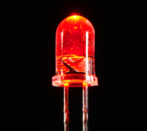
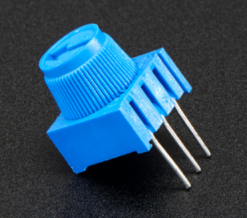
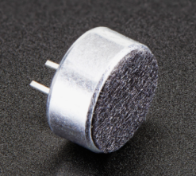

# Kidsbits Coding Box Kit

# Introduction

Coding Box is a programming learning toolbox based on Arduino, which is a programming tool specially designed for children over 6 years old.

It integrates some of the most basic electronic components and sensors, such as LEDs, buttons, motors, light, sound, infrared and a temperature sensor.

Besides, multitudes of interesting projects can be carried out via the Coding Box, including LED flashing, intrusion alarms, smart fans as well as temperature testers.

Coding Box uses Arduino for programming, and is also compatible with Mixly graphical programming software and Scratch graphical programming software，allowing children to learn from the simplest code and master the system's programming knowledge step by step.

# Component List

| Name                 | Picture                                              | Pins                                        | Summary                                                                                                                                                                                                                                                                                                                                                                                                                                        |
|----------------------|------------------------------------------------------|--------------------------------------------------|------------------------------------------------------------------------------------------------------------------------------------------------------------------------------------------------------------------------------------------------------------------------------------------------------------------------------------------------------------------------------------------------------------------------------------------------|
|      LED             |       | D7 and D8  | LIGHT-EMITTING DIODES (LEDS) have a positive  (+) leg and a negative (-) leg, which  make electricity flow through in one  direction.  LEDs can also burn out if too much  electricity flows through them, so you should use  a resistor to limit the high current when you  wire an LED into a circuit.  They can be  used to make equipment indicator light. Set the  signal pin to HIGH, LED will be on; set to  LOW, LED will be off.               |
|    RGB               |       | D6,D5,D3   | RGB LED is actually three small LEDs — a red,  green and blue LED— inside a normal LED  housing.  It has all the internal LEDs sharing  the same ground wire, so there are four pins in  total.  It can emit many different color,  which is. used widely for building lighting and  exhibition lighting.                                                                                                                                            |
|   LED Dot Matrix     |       |A4, A5      | LED Dot Matrix: This tiny display has 64  LEDs packed into a 8\*8 dot matrix. It is great  for displaying image/text or creating  animations, and is highly portable and  convenient to use, which is widely used in train  stations, advertising screens and bulletin  boards.                                                                                                                                                                      |
|     Servo            |       |   D9       | Servo is a position control rotary  actuator. Common servos rotate over a range of  about 0°to 180°. It has three wires: one for  power, one for grounding and one for signal.   When you send the right signal through the  signal wire, the servo will move to a specific  angle and stay there. It is widely applied to  mechanical arm.                                                                                                           |
|   Buzzer             |       | D4         | Buzzer is a consumable component that  can generate sound of a specified frequency  according to the input signal. It is widely used  in alarm, electronic toys, automotive  electronics, telephones and other electronic  products.                                                                                                                                                                                                                |
|   Motor fan          |       |  D10, D11  | Motor fan module is a consumable component  that is connected with a fan blade and a motor  (130 DC motor). It can rotate more than 12,000  times per minute, which is widely used in  helicopters, windmills, etc.                                                                                                                                                                                                                                |
|    Button            |       |  D12, D13  | Button is a component that controls the  circuit to turn on and off. When the button is  pressed, it sends a high level signal (the  Arduino Uno reads 0) to the kidsbits coding box  (based on Arduino Uno) through the pins. We can  interact with the device by using buttons, such  as those used in the course to control the leds  on and off.                                                                                                  |
|   Photoresistor      |       |   A6       | Photoresistor is a light-sensitive and  variable resistor, which is an element that  changes its resistance as light strength  changes.  The stronger the ambient light, the  smaller the value output from the pin A.  It is  widely applied to various light control circuit,  such as optical switches, and smart home system  etc.                                                                                                                |
|     Potentiometer    |       |  A7        | Potentiometer (also known as ''trimpot”)  is a sensor that controls the output signal of  the pin by changing the resistance value.  A  potentiometer is a 3-pin variable resistor. When  powered with 5V, the middle pin outputs a  voltage between 0V and 5V, depending on the  position of the knob on the potentiometer.  It  is mainly used to set the threshold value in the  circuit, or as a controller to control the Servo  motion, etc.      |
|     Sound Sensor     |       |  A2        | Sound Sensor is a device which convert  energy from one form to another.  A microphone  is a transducer which converts sound energy to  electrical signals.  The microphones are widely  used in electronic circuits to detect  minor sounds or air vibrations which in turn are  converted to electrical signals for further  use.  The top face is covered with a porous material  with the help of glue. It acts as a filter for the dust particles |
|   Temperature Sensor |       |   A3       | Temperature Sensor is a component that  can convert the measured temperature signal into  a voltage signal output. It is widely used  in digital thermometers, medical/home  thermometers, portable non-contact infrared  temperature thermometers, etc.                                                                                                                                                                                            |
|   Gas Sensor         |       |   A1       | Gas Sensor is a component that can detect  the concentration of flammable gases and  smoke in the environment. It is widely used  in household gas leak alarms, industrial  combustible gas alarms and portable gas detectors.                                                                                                                                                                                                                     |
|   PIR Motion Sensor  |       |   D2        | PIR Motion Sensor is a sensor that uses  the characteristics of temperature change  to detect infrared radiation. When a person  enters its sensing range, it outputs a high  level. When the person leaves the sensing range,  it automatically delays the high level and  outputs a low level, which is widely used in  infrared automatic sensor lights, sensor  switches, burglar alarms and IR welcome device.                                    |
|   Reed switch        |       |   A0        | Reed Sensor, also known as reed switch,  is an electrical switch operated by an applied  magnetic field, which is widely used in  household appliances, automobiles,  communications, industry, medical area,  security and other fields.                                                                                                                                                                                                           |

